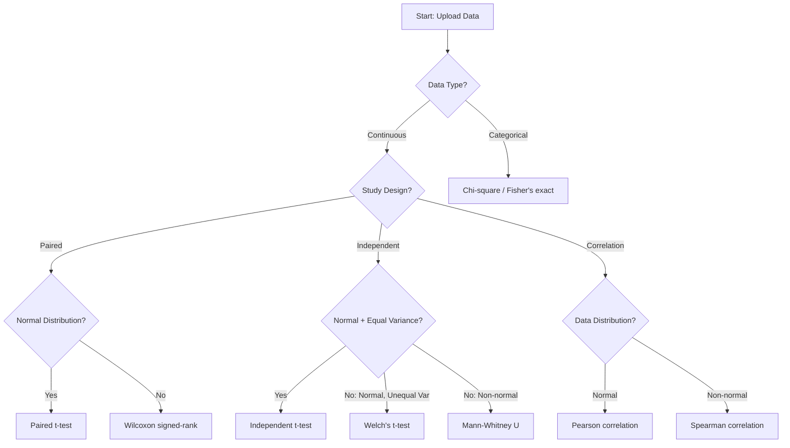

# StatmateAI 🧠📊

**AI-Driven Statistical Analysis for Clinical and Observational Research**

StatmateAI is a complete full-stack application that automates statistical analysis workflows using LLM agents, providing an intuitive interface for researchers to upload data, run analyses, and interpret results.

[](https://www.python.org/downloads/)
[](https://fastapi.tiangolo.com)
[](https://streamlit.io)
[](LICENSE)

---

## 📋 Table of Contents

- [Overview](#-overview)
- [Features](#-features)
- [Quick Start](#-quick-start)
- [Documentation](#-documentation)
- [Statistical Tests](#-statistical-tests)
- [Architecture](#-architecture)
- [Development](#-development)
- [Contributing](#-contributing)

---

## 🎯 Overview

StatmateAI combines the power of LLM agents with traditional statistical methods to provide:

- **Automated Test Selection**: AI agents analyze your data and recommend appropriate statistical tests
- **Interactive Web UI**: Streamlit-based interface for easy data upload and result visualization
- **RESTful API**: FastAPI backend with 18 endpoints for programmatic access
- **Task Scheduling**: Background and recurring analysis jobs via APScheduler
- **Comprehensive Results**: Statistical trees, p-values, effect sizes, and natural language summaries

### Perfect For

- 🏥 Clinical researchers with small-sample studies
- 🔬 Observational research requiring rigorous statistical analysis
- 📊 Data scientists needing automated test selection
- 🧪 Teams wanting reproducible, auditable analysis workflows

---

## ✨ Features

### Core Capabilities

- 🧠 **AI-Driven Test Selection**: Automatically selects appropriate statistical tests based on:
  - Data type (continuous, categorical, ordinal)
  - Study design (paired, independent, one-sample)
  - Sample size and distribution
  - Research question (comparison, association, correlation)

- 📊 **Comprehensive Statistical Tests**:
  - Normality tests (Shapiro-Wilk, Kolmogorov-Smirnov)
  - Parametric tests (t-tests, ANOVA)
  - Non-parametric tests (Wilcoxon, Mann-Whitney, Kruskal-Wallis)
  - Correlation analysis (Pearson, Spearman)
  - Categorical tests (Chi-square, Fisher's exact)

- 📋 **Structured Results**:
  - JSON-formatted statistical output
  - Natural language summaries for publication
  - P-values with significance indicators
  - Effect sizes and confidence intervals
  - Execution logs for reproducibility

- 🔍 **Quality Checks**:
  - Automatic assumption validation
  - Data quality diagnostics
  - Methodological warnings
  - Outlier detection

### Web Application

- 📁 **File Upload**: Drag-and-drop CSV/Excel files
- 👁️ **Data Preview**: Interactive table with column inspection
- ⚙️ **Column Selection**: Choose specific variables for analysis
- ▶️ **One-Click Analysis**: Run statistical tests with a button
- 📊 **Results Dashboard**: View status, summaries, p-values, and logs
- 🗄️ **Dataset Management**: Save, list, preview, and delete datasets
- ⏰ **Task Scheduling**: Schedule recurring analyses (daily, weekly, monthly)

### API Features

- 🔌 **RESTful Endpoints**: 18 routes for full CRUD operations
- 📚 **Auto-Generated Docs**: Interactive API documentation at `/docs`
- 🔒 **CORS Support**: Configurable cross-origin requests
- 📦 **File Handling**: Efficient parquet-based storage
- ⚡ **Background Jobs**: Non-blocking analysis execution
- 🗃️ **SQLite/PostgreSQL**: Flexible database backend

---

## 🏗️ Architecture

```
┌─────────────────────────────────────────────────────┐
│                   Browser (User)                    │
└─────────────────────┬───────────────────────────────┘
                      │
          ┌───────────┴──────────┐
          ▼                      ▼
┌──────────────────┐   ┌──────────────────┐
│  Streamlit UI    │   │  Custom Frontend │
│  (Port 8501)     │   │  (React/Mobile)  │
└────────┬─────────┘   └────────┬─────────┘
         │                      │
         └──────────┬───────────┘
                    ▼ HTTP/REST
         ┌────────────────────────┐
         │   FastAPI Backend      │
         │     (Port 8000)        │
         ├────────────────────────┤
         │  • Routes (endpoints)  │
         │  • Services (logic)    │
         │  • Scheduler (tasks)   │
         └──────────┬─────────────┘
                    │
     ┌──────────────┼──────────────┐
     ▼              ▼              ▼
┌─────────┐   ┌──────────┐   ┌──────────┐
│ SQLite  │   │ Parquet  │   │APScheduler│
│Database │   │  Files   │   │Background │
└─────────┘   └──────────┘   └──────────┘
                    │
                    ▼
         ┌────────────────────────┐
         │  StatMate Core Engine  │
         ├────────────────────────┤
         │  • LangGraph Workflow  │
         │  • Pydantic AI Agents  │
         │  • SciPy/Statsmodels   │
         └──────────┬─────────────┘
                    ▼
              ┌──────────┐
              │ OpenAI   │
              │   API    │
              └──────────┘
```

### Technology Stack

**Frontend V1:**
- Streamlit 1.28+ (Interactive UI)
- HTTPX (HTTP client)
- Pandas (Data display)

**Backend:**
- FastAPI 0.104+ (REST API framework)
- SQLAlchemy 2.0+ (ORM)
- APScheduler 3.10+ (Task scheduling)
- Pydantic 2.0+ (Validation)
- Uvicorn (ASGI server)

**Core Engine:**
- LangGraph (Workflow orchestration)
- Pydantic AI (LLM agent framework)
- OpenAI GPT-4 (LLM reasoning)
- SciPy (Statistical computations)
- Statsmodels (Advanced models)

**Storage:**
- SQLite (Development database)
- PostgreSQL (Production database)
- Parquet (Efficient dataset storage)
- JSON (Results storage)

**DevOps:**
- Docker & Docker Compose
- GitHub Actions (CI/CD)
- Prometheus & Grafana (Monitoring)

---

## 🚀 Quick Start

### Option 1: Use Ollama (FREE & Local - Recommended!)

**Run AI models locally with NO API costs:**

```bash
# 1. Clone and install
git clone https://github.com/yourusername/statmate-ai.git
cd statmate-ai
make install

# 2. Install Ollama (one-time)
brew install ollama              # macOS
# OR: curl -fsSL https://ollama.ai/install.sh | sh  # Linux

# 3. Start Ollama and get model
ollama serve &
ollama pull deepseek-r1:8b      # Reasoning model, ~5GB

# 4. Configure for Ollama
make setup-env
nano .env  # Set: OLLAMA_ENABLED=True, DEFAULT_MODEL_PROVIDER=ollama

# 5. Initialize database
make db-init db-seed

# 6. Run!
make dev    # Terminal 1 - API
make ui     # Terminal 2 - UI
```

> 🎯 **Full Ollama Guide:** See [Ollama Setup Guide](docs/OLLAMA_SETUP.md) for detailed instructions

---

### Option 2: Use Cloud API (OpenAI, Anthropic, Google, etc.)

```bash
# 1. Clone and install
git clone https://github.com/yourusername/statmate-ai.git
cd statmate-ai
make install

# 2. Setup environment
make setup-env
nano .env  # Add your OPENAI_API_KEY=sk-... (or other provider)

# 3. Initialize database
make db-init db-seed

# 4. Run!
make dev    # Terminal 1 - API
make ui     # Terminal 2 - UI
```

---

**Access the Application:**
- 🎨 **Streamlit UI**: http://localhost:8501
- 🔌 **API Docs**: http://localhost:8000/docs
- 📊 **API Base**: http://localhost:8000/api/v1

**Stop the Application:**
```bash
make kill   # Stops both API and UI
```

### Development vs Production

**Development Mode** (Uses .env file):
```bash
make dev    # Start API with your .env credentials
make ui     # Start UI
make kill   # Stop everything
```

**Production Mode** (Users provide credentials):
```bash
make prod   # Users enter API keys via UI
make kill   # Stop everything
```

> 📖 **Detailed Setup:** See [Setup Guide](docs/SETUP_GUIDE.md) for comprehensive instructions  
> 🤖 **Ollama Guide:** See [Ollama Setup](docs/OLLAMA_SETUP.md) for local AI models

---

## 📚 Documentation

### 📖 Getting Started Guides

| Guide | Description | For Who | Time |
|-------|-------------|---------|------|
| **[Setup Guide](docs/SETUP_GUIDE.md)** | Quick setup for DEV & PROD modes | First-time users | 5 min |
| **[Ollama Setup](docs/OLLAMA_SETUP.md)** | 🔥 Run AI locally (FREE!) | Everyone | 10 min |
| **[Adding Models](docs/ADDING_MODELS.md)** | How to add new AI models | Customizers | 5 min |
| **[Quick Reference](docs/QUICK_REFERENCE.md)** | Command cheat sheet | Everyone | 2 min |
| **[Dev vs Prod Guide](docs/DEV_VS_PROD_GUIDE.md)** | Credential management deep dive | Developers & Deployers | 15 min |
| **[Quick Start](docs/QUICK_START.md)** | Fast API setup and first calls | API users | 5 min |

### 🏗️ Architecture & Design

| Document | Description | For Who |
|----------|-------------|---------|
| **[Architecture Proposal](docs/ARCHITECTURE_PROPOSAL.md)** | System design & future plans | Architects, Contributors |
| **[Implementation Guide](docs/IMPLEMENTATION_GUIDE.md)** | How everything works internally | Backend developers |
| **[Workflow Documentation](docs/WORKFLOW.md)** | LangGraph workflow & test selection | Data scientists |
| **[Service Layer](docs/SERVICE_LAYER.md)** | Business logic reference | Backend developers |

### 🔌 API & Integration

| Document | Description | For Who |
|----------|-------------|---------|
| **[API Reference](docs/API_REFERENCE.md)** | Complete REST API docs (18 endpoints) | Frontend developers, Integrators |
| **[Backend Setup](docs/BACKEND_SETUP.md)** | Development environment setup | Developers |

### 🚀 Operations & Deployment

| Document | Description | For Who |
|----------|-------------|---------|
| **[DevOps Plan](docs/DEVOPS_PLAN.md)** | CI/CD, Docker, monitoring | DevOps engineers |
| **[Credentials System](docs/CREDENTIALS_SYSTEM.md)** | Security implementation details | Security-conscious deployers |

### 🤖 AI Models

| Document | Description | For Who |
|----------|-------------|---------|
| **[Model Configuration](docs/MODEL_CONFIGURATION.md)** | AI model setup & providers | AI/ML engineers |
| **[Flexible Model System](docs/FLEXIBLE_MODEL_SYSTEM.md)** | Multi-provider model system | Developers |
| **[Model Quick Reference](docs/QUICK_REFERENCE_MODELS.md)** | Model selection guide | Everyone |
| **[UI Model Integration](docs/UI_MODEL_INTEGRATION.md)** | Frontend model integration | Frontend developers |

### 📊 Additional Resources

| Document | Description |
|----------|-------------|
| **[Flexible Models Summary](docs/FLEXIBLE_MODELS_SUMMARY.md)** | Multi-model implementation summary |
| **[UI Integration Complete](docs/UI_INTEGRATION_COMPLETE.md)** | UI implementation status |
| **[Documentation Summary](docs/DOCUMENTATION_SUMMARY.md)** | Overview of all documentation |

### 🎯 Documentation by Use Case

**"I want to try it quickly"**
→ [Setup Guide](docs/SETUP_GUIDE.md) → [Quick Reference](docs/QUICK_REFERENCE.md)

**"I want to understand the system"**
→ [Architecture Proposal](docs/ARCHITECTURE_PROPOSAL.md) → [Implementation Guide](docs/IMPLEMENTATION_GUIDE.md)

**"I want to deploy it"**
→ [Dev vs Prod Guide](docs/DEV_VS_PROD_GUIDE.md) → [DevOps Plan](docs/DEVOPS_PLAN.md)

**"I want to contribute"**
→ [Architecture](docs/ARCHITECTURE_PROPOSAL.md) → [Implementation Guide](docs/IMPLEMENTATION_GUIDE.md) → [Service Layer](docs/SERVICE_LAYER.md)

**"I want to integrate the API"**
→ [API Reference](docs/API_REFERENCE.md) → Interactive docs at `/docs`

---

## 📖 Usage

### Via Web Interface

1. **Upload Data** (Tab 1):
   - Click "Browse files" or drag-and-drop
   - Support formats: CSV, Excel (.xlsx, .xls)
   - Optional: Add description
   - Click "Upload Dataset"

2. **Run Analysis** (Tab 2):
   - Select dataset from sidebar
   - Preview data (first 10 rows)
   - Choose columns for analysis (optional)
   - Click "🎯 Run Stat Test"

3. **View Results** (Tab 3):
   - Check analysis status
   - Read AI-generated summary
   - Inspect p-values table
   - View detailed JSON results
   - Download execution log

### Via API

**Upload Dataset:**
```bash
curl -X POST http://localhost:8000/api/v1/datasets/upload \
  -F "file=@mydata.csv" \
  -F "description=Clinical trial data"
```

**Run Analysis:**
```bash
curl -X POST http://localhost:8000/api/v1/analysis/run \
  -H "Content-Type: application/json" \
  -d '{
    "dataset_id": "your-dataset-uuid",
    "selected_columns": ["age", "treatment", "outcome"]
  }'
```

**Get Results:**
```bash
curl http://localhost:8000/api/v1/analysis/{analysis-id}/results
```

**Schedule Recurring Task:**
```bash
curl -X POST http://localhost:8000/api/v1/tasks/schedule \
  -H "Content-Type: application/json" \
  -d '{
    "name": "Daily Analysis",
    "task_type": "recurring",
    "dataset_id": "your-dataset-uuid",
    "schedule": "0 2 * * *"
  }'
```

### Via Python SDK (Coming Soon)

```python
from statmate import StatmateClient

client = StatmateClient(api_url="http://localhost:8000")

# Upload dataset
dataset = client.upload_dataset("data.csv")

# Run analysis
analysis = client.run_analysis(
    dataset_id=dataset.id,
    columns=["age", "treatment", "outcome"]
)

# Get results
results = client.get_results(analysis.id)
print(results.summary)
print(results.p_values)
```

---

## 🧪 Statistical Tests

### Implemented Tests ✅

**Normality Tests:**
- ✅ Shapiro-Wilk test
- ✅ Kolmogorov-Smirnov test
- ✅ Anderson-Darling test

**Parametric Tests:**
- ✅ Independent samples t-test
- ✅ Paired samples t-test
- ✅ One-sample t-test
- ✅ Welch's t-test (unequal variances)
- ✅ One-way ANOVA
- ✅ Repeated measures ANOVA

**Non-Parametric Tests:**
- ✅ Mann-Whitney U test
- ✅ Wilcoxon signed-rank test
- ✅ Kruskal-Wallis H test
- ✅ Friedman test

**Correlation:**
- ✅ Pearson correlation
- ✅ Spearman rank correlation

**Categorical:**
- ✅ Chi-square test of independence
- ✅ Fisher's exact test
- ✅ McNemar's test

### Statistical Decision Flow



---

## 🛠️ Development

### Quick Commands

```bash
# Development
make dev              # Run in DEV mode
make ui               # Run Streamlit UI
make api              # Run FastAPI backend

# Database
make db-init          # Initialize database
make db-seed          # Add sample data
make db-reset         # Reset database

# Quality
make test             # Run tests
make lint             # Check code quality
make format           # Format code
make type-check       # Type checking

# Utilities
make clean            # Clean temp files
make status           # Check system status
make help             # Show all commands
```

### Setup Development Environment

```bash
# Install with dev dependencies
make install-dev

# Or manually
pip install -e ".[dev]"
```

### Contributing

We welcome contributions!

**Quick Start:**
1. Read [Architecture Proposal](docs/ARCHITECTURE_PROPOSAL.md) - Understand the vision
2. Read [Implementation Guide](docs/IMPLEMENTATION_GUIDE.md) - See what exists
3. Fork the repository
4. Create a feature branch (`git checkout -b feature/amazing-feature`)
5. Make your changes
6. Run tests and linting (`make test && make lint`)
7. Commit changes (`git commit -m 'Add amazing feature'`)
8. Push to branch (`git push origin feature/amazing-feature`)
9. Open a Pull Request

**Detailed Guides:**
- [Backend Setup](docs/BACKEND_SETUP.md) - Development environment
- [Service Layer](docs/SERVICE_LAYER.md) - Business logic patterns
- [Workflow Documentation](docs/WORKFLOW.md) - Adding statistical tests

---

## 🗺️ Roadmap

### Phase 1: Core Functionality ✅ (Complete)

- [x] Backend API with FastAPI
- [x] Streamlit frontend
- [x] Database models and storage
- [x] Basic statistical tests
- [x] LangGraph workflow
- [x] Task scheduling

### Phase 2: Advanced Features 🚧 (In Progress)

- [ ] Effect size calculations
- [ ] Post-hoc tests (Tukey, Bonferroni, etc.)
- [ ] Multi-comparison adjustments
- [ ] Regression models (Linear, Logistic)
- [ ] Survival analysis (Kaplan-Meier, Cox)
- [ ] Authentication and user management
- [ ] Export to R/SPSS/SAS formats

### Phase 3: Enhanced UI 🔮 (Planned)

- [ ] React/Next.js frontend (Frontend V2)
- [ ] Real-time updates via WebSockets
- [ ] Interactive visualizations (Plotly, D3.js)
- [ ] Collaborative analysis
- [ ] Version control for analyses
- [ ] Dashboard analytics

### Phase 4: Mobile & Desktop 🔮 (Planned)

- [ ] React Native mobile app
- [ ] Flutter mobile app
- [ ] Progressive Web App (PWA)
- [ ] Desktop app (Electron)
- [ ] Offline mode

### Phase 5: Enterprise 🔮 (Future)

- [ ] Multi-tenancy
- [ ] Role-based access control (RBAC)
- [ ] Audit logs
- [ ] SSO integration (SAML, OAuth)
- [ ] Data encryption at rest
- [ ] Compliance reporting (HIPAA, GDPR)
- [ ] On-premise deployment

---

## 📄 License

This project is licensed under the MIT License - see the [LICENSE](LICENSE) file for details.

---

## 🙏 Acknowledgments

- **OpenAI** for GPT-4 API
- **Pydantic AI** for agent framework
- **LangGraph** for workflow orchestration
- **FastAPI** for modern Python web framework
- **Streamlit** for rapid UI development
- **SciPy** and **Statsmodels** for statistical computations

---

## 📞 Contact & Support

- 📧 **Email**: support@statmate-ai.com
- 💬 **Discussions**: [GitHub Discussions](https://github.com/yourusername/statmate-ai/discussions)
- 🐛 **Issues**: [GitHub Issues](https://github.com/yourusername/statmate-ai/issues)
- 📖 **Documentation**: [Full Docs](https://docs.statmate-ai.com)

---

## 🌟 Star History

If you find StatmateAI useful, please consider giving it a ⭐ on GitHub!

---

**Built with ❤️ by the StatmateAI Team**
