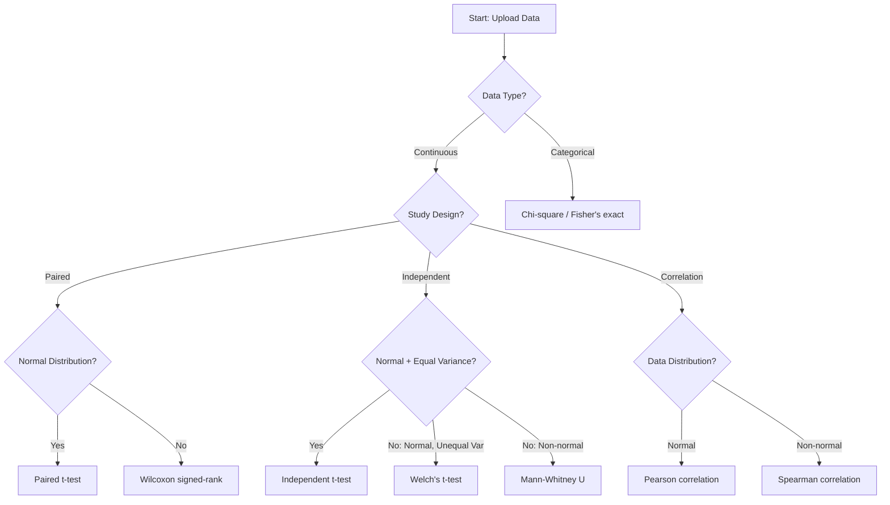

# StatmateAI 🧠📊

**AI-Driven Statistical Analysis for Clinical and Observational Research**

StatmateAI is a complete full-stack application that automates statistical analysis workflows using LLM agents, providing an intuitive interface for researchers to upload data, run analyses, and interpret results.

[](https://www.python.org/downloads/)
[](https://fastapi.tiangolo.com)
[](https://streamlit.io)
[](LICENSE)

---

## 📋 Table of Contents

- [Overview](#-overview)
- [Features](#-features)
- [Architecture](#-architecture)
- [Quick Start](#-quick-start)
- [Usage](#-usage)
- [Statistical Tests](#-statistical-tests)
- [API Documentation](#-api-documentation)
- [Project Structure](#-project-structure)
- [Development](#-development)
- [Roadmap](#-roadmap)
- [Contributing](#-contributing)

---

## 🎯 Overview

StatmateAI combines the power of LLM agents with traditional statistical methods to provide:

- **Automated Test Selection**: AI agents analyze your data and recommend appropriate statistical tests
- **Interactive Web UI**: Streamlit-based interface for easy data upload and result visualization
- **RESTful API**: FastAPI backend with 18 endpoints for programmatic access
- **Task Scheduling**: Background and recurring analysis jobs via APScheduler
- **Comprehensive Results**: Statistical trees, p-values, effect sizes, and natural language summaries

### Perfect For

- 🏥 Clinical researchers with small-sample studies
- 🔬 Observational research requiring rigorous statistical analysis
- 📊 Data scientists needing automated test selection
- 🧪 Teams wanting reproducible, auditable analysis workflows

---

## ✨ Features

### Core Capabilities

- 🧠 **AI-Driven Test Selection**: Automatically selects appropriate statistical tests based on:
  - Data type (continuous, categorical, ordinal)
  - Study design (paired, independent, one-sample)
  - Sample size and distribution
  - Research question (comparison, association, correlation)

- 📊 **Comprehensive Statistical Tests**:
  - Normality tests (Shapiro-Wilk, Kolmogorov-Smirnov)
  - Parametric tests (t-tests, ANOVA)
  - Non-parametric tests (Wilcoxon, Mann-Whitney, Kruskal-Wallis)
  - Correlation analysis (Pearson, Spearman)
  - Categorical tests (Chi-square, Fisher's exact)

- 📋 **Structured Results**:
  - JSON-formatted statistical output
  - Natural language summaries for publication
  - P-values with significance indicators
  - Effect sizes and confidence intervals
  - Execution logs for reproducibility

- 🔍 **Quality Checks**:
  - Automatic assumption validation
  - Data quality diagnostics
  - Methodological warnings
  - Outlier detection

### Web Application

- 📁 **File Upload**: Drag-and-drop CSV/Excel files
- 👁️ **Data Preview**: Interactive table with column inspection
- ⚙️ **Column Selection**: Choose specific variables for analysis
- ▶️ **One-Click Analysis**: Run statistical tests with a button
- 📊 **Results Dashboard**: View status, summaries, p-values, and logs
- 🗄️ **Dataset Management**: Save, list, preview, and delete datasets
- ⏰ **Task Scheduling**: Schedule recurring analyses (daily, weekly, monthly)

### API Features

- 🔌 **RESTful Endpoints**: 18 routes for full CRUD operations
- 📚 **Auto-Generated Docs**: Interactive API documentation at `/docs`
- 🔒 **CORS Support**: Configurable cross-origin requests
- 📦 **File Handling**: Efficient parquet-based storage
- ⚡ **Background Jobs**: Non-blocking analysis execution
- 🗃️ **SQLite/PostgreSQL**: Flexible database backend

---

## 🏗️ Architecture

```
┌─────────────────────────────────────────────────────┐
│                   Browser (User)                    │
└─────────────────────┬───────────────────────────────┘
                      │
          ┌───────────┴──────────┐
          ▼                      ▼
┌──────────────────┐   ┌──────────────────┐
│  Streamlit UI    │   │  Custom Frontend │
│  (Port 8501)     │   │  (React/Mobile)  │
└────────┬─────────┘   └────────┬─────────┘
         │                      │
         └──────────┬───────────┘
                    ▼ HTTP/REST
         ┌────────────────────────┐
         │   FastAPI Backend      │
         │     (Port 8000)        │
         ├────────────────────────┤
         │  • Routes (endpoints)  │
         │  • Services (logic)    │
         │  • Scheduler (tasks)   │
         └──────────┬─────────────┘
                    │
     ┌──────────────┼──────────────┐
     ▼              ▼              ▼
┌─────────┐   ┌──────────┐   ┌──────────┐
│ SQLite  │   │ Parquet  │   │APScheduler│
│Database │   │  Files   │   │Background │
└─────────┘   └──────────┘   └──────────┘
                    │
                    ▼
         ┌────────────────────────┐
         │  StatMate Core Engine  │
         ├────────────────────────┤
         │  • LangGraph Workflow  │
         │  • Pydantic AI Agents  │
         │  • SciPy/Statsmodels   │
         └──────────┬─────────────┘
                    ▼
              ┌──────────┐
              │ OpenAI   │
              │   API    │
              └──────────┘
```

### Technology Stack

**Frontend V1:**
- Streamlit 1.28+ (Interactive UI)
- HTTPX (HTTP client)
- Pandas (Data display)

**Backend:**
- FastAPI 0.104+ (REST API framework)
- SQLAlchemy 2.0+ (ORM)
- APScheduler 3.10+ (Task scheduling)
- Pydantic 2.0+ (Validation)
- Uvicorn (ASGI server)

**Core Engine:**
- LangGraph (Workflow orchestration)
- Pydantic AI (LLM agent framework)
- OpenAI GPT-4 (LLM reasoning)
- SciPy (Statistical computations)
- Statsmodels (Advanced models)

**Storage:**
- SQLite (Development database)
- PostgreSQL (Production database)
- Parquet (Efficient dataset storage)
- JSON (Results storage)

**DevOps:**
- Docker & Docker Compose
- GitHub Actions (CI/CD)
- Prometheus & Grafana (Monitoring)

---

## 🚀 Quick Start

### Prerequisites

- Python 3.11 or higher
- OpenAI API key (for LLM agents)

### Installation

1. **Clone the repository:**
   ```bash
   git clone https://github.com/yourusername/statmate-ai.git
   cd statmate-ai
   ```

2. **Create virtual environment:**
   ```bash
   python -m venv .venv
   source .venv/bin/activate  # On Windows: .venv\Scripts\activate
   ```

3. **Install dependencies:**
   ```bash
   pip install -e .
   ```

4. **Set up environment:**
   ```bash
   cp .env.example .env
   # Edit .env and add your OPENAI_API_KEY
   ```

5. **Initialize database:**
   ```bash
   python scripts/init_db.py
   python scripts/seed_db.py  # Optional: add sample data
   ```

### Running the Application

**Option 1: Development Script (Recommended)**
```bash
bash scripts/run_dev.sh
```

**Option 2: Manual Start**

Terminal 1 - Start API:
```bash
source .venv/bin/activate
python statmate/api/main.py
```

Terminal 2 - Start UI:
```bash
source .venv/bin/activate
streamlit run statmate/ui/app.py
```

**Access the Application:**
- 🎨 **Streamlit UI**: http://localhost:8501
- 🔌 **API Docs**: http://localhost:8000/docs
- 📊 **API Base**: http://localhost:8000/api/v1

---

## 📖 Usage

### Via Web Interface

1. **Upload Data** (Tab 1):
   - Click "Browse files" or drag-and-drop
   - Support formats: CSV, Excel (.xlsx, .xls)
   - Optional: Add description
   - Click "Upload Dataset"

2. **Run Analysis** (Tab 2):
   - Select dataset from sidebar
   - Preview data (first 10 rows)
   - Choose columns for analysis (optional)
   - Click "🎯 Run Stat Test"

3. **View Results** (Tab 3):
   - Check analysis status
   - Read AI-generated summary
   - Inspect p-values table
   - View detailed JSON results
   - Download execution log

### Via API

**Upload Dataset:**
```bash
curl -X POST http://localhost:8000/api/v1/datasets/upload \
  -F "file=@mydata.csv" \
  -F "description=Clinical trial data"
```

**Run Analysis:**
```bash
curl -X POST http://localhost:8000/api/v1/analysis/run \
  -H "Content-Type: application/json" \
  -d '{
    "dataset_id": "your-dataset-uuid",
    "selected_columns": ["age", "treatment", "outcome"]
  }'
```

**Get Results:**
```bash
curl http://localhost:8000/api/v1/analysis/{analysis-id}/results
```

**Schedule Recurring Task:**
```bash
curl -X POST http://localhost:8000/api/v1/tasks/schedule \
  -H "Content-Type: application/json" \
  -d '{
    "name": "Daily Analysis",
    "task_type": "recurring",
    "dataset_id": "your-dataset-uuid",
    "schedule": "0 2 * * *"
  }'
```

### Via Python SDK (Coming Soon)

```python
from statmate import StatmateClient

client = StatmateClient(api_url="http://localhost:8000")

# Upload dataset
dataset = client.upload_dataset("data.csv")

# Run analysis
analysis = client.run_analysis(
    dataset_id=dataset.id,
    columns=["age", "treatment", "outcome"]
)

# Get results
results = client.get_results(analysis.id)
print(results.summary)
print(results.p_values)
```

---

## 🧪 Statistical Tests

### Implemented Tests ✅

**Normality Tests:**
- ✅ Shapiro-Wilk test
- ✅ Kolmogorov-Smirnov test
- ✅ Anderson-Darling test

**Parametric Tests:**
- ✅ Independent samples t-test
- ✅ Paired samples t-test
- ✅ One-sample t-test
- ✅ Welch's t-test (unequal variances)
- ✅ One-way ANOVA
- ✅ Repeated measures ANOVA

**Non-Parametric Tests:**
- ✅ Mann-Whitney U test
- ✅ Wilcoxon signed-rank test
- ✅ Kruskal-Wallis H test
- ✅ Friedman test

**Correlation:**
- ✅ Pearson correlation
- ✅ Spearman rank correlation

**Categorical:**
- ✅ Chi-square test of independence
- ✅ Fisher's exact test
- ✅ McNemar's test

### Statistical Decision Flow



---

## 📚 API Documentation

### Endpoint Summary

All endpoints are prefixed with `/api/v1`

#### Datasets

| Method | Endpoint                 | Description           |
| ------ | ------------------------ | --------------------- |
| POST   | `/datasets/upload`       | Upload CSV/Excel file |
| GET    | `/datasets/`             | List all datasets     |
| GET    | `/datasets/{id}`         | Get dataset details   |
| GET    | `/datasets/{id}/preview` | Preview dataset rows  |
| DELETE | `/datasets/{id}`         | Delete dataset        |

#### Analysis

| Method | Endpoint                 | Description              |
| ------ | ------------------------ | ------------------------ |
| POST   | `/analysis/run`          | Run statistical analysis |
| GET    | `/analysis/{id}`         | Get analysis status      |
| GET    | `/analysis/{id}/results` | Get full results         |
| GET    | `/analysis/{id}/log`     | Get execution log        |
| GET    | `/analysis/`             | List all analyses        |

#### Scheduled Tasks

| Method | Endpoint             | Description           |
| ------ | -------------------- | --------------------- |
| POST   | `/tasks/schedule`    | Create scheduled task |
| GET    | `/tasks/`            | List all tasks        |
| GET    | `/tasks/{id}`        | Get task details      |
| PUT    | `/tasks/{id}/pause`  | Pause task            |
| PUT    | `/tasks/{id}/resume` | Resume task           |
| DELETE | `/tasks/{id}`        | Delete task           |

#### Results

| Method | Endpoint        | Description        |
| ------ | --------------- | ------------------ |
| GET    | `/results/`     | List all results   |
| GET    | `/results/{id}` | Get result details |

**Interactive Documentation:**  
Visit http://localhost:8000/docs for full Swagger UI with try-it-out functionality.

---

## 📁 Project Structure

```
statmate-ai/
├── statmate/                   # Core application
│   ├── core/                   # Core utilities
│   │   ├── logging_config.py   # Logging setup
│   │   └── exceptions.py       # Custom exceptions
│   │
│   ├── agents/                 # LLM agents
│   │   ├── normality_agents.py # Normality test agents
│   │   ├── comparison_agents.py# Comparison test agents
│   │   └── ...                 # Other agent modules
│   │
│   ├── statistical_core/       # Statistical implementations
│   │   ├── normality.py        # Normality tests
│   │   ├── comparison.py       # T-tests, Mann-Whitney, etc.
│   │   └── ...                 # Other test modules
│   │
│   ├── workflow/               # LangGraph workflows
│   │   └── statmate_flow.py    # Main workflow graph
│   │
│   ├── api/                    # FastAPI backend
│   │   ├── main.py             # API entry point
│   │   ├── dependencies.py     # Shared dependencies
│   │   │
│   │   ├── models/             # Pydantic request/response models
│   │   │   ├── dataset.py
│   │   │   ├── analysis.py
│   │   │   ├── task.py
│   │   │   └── result.py
│   │   │
│   │   ├── routes/             # API route handlers
│   │   │   ├── datasets.py
│   │   │   ├── analysis.py
│   │   │   ├── tasks.py
│   │   │   └── results.py
│   │   │
│   │   ├── services/           # Business logic
│   │   │   ├── storage_service.py
│   │   │   ├── dataset_service.py
│   │   │   ├── analysis_service.py
│   │   │   └── task_service.py
│   │   │
│   │   └── scheduler/          # Background tasks
│   │       ├── scheduler.py
│   │       └── jobs.py
│   │
│   └── ui/                     # Streamlit frontend
│       └── app.py              # UI application
│
├── database/                   # Database layer
│   ├── models.py               # SQLAlchemy models
│   └── session.py              # Session management
│
├── config/                     # Configuration
│   └── settings.py             # Pydantic Settings
│
├── data/                       # Data storage
│   ├── uploads/                # Uploaded datasets
│   ├── results/                # Analysis results
│   └── logs/                   # Execution logs
│
├── scripts/                    # Utility scripts
│   ├── init_db.py              # Initialize database
│   ├── seed_db.py              # Seed sample data
│   └── run_dev.sh              # Development startup
│
├── tests/                      # Test suite
│   ├── unit/
│   ├── integration/
│   └── e2e/
│
├── docs/                       # Documentation
│   ├── ARCHITECTURE_PROPOSAL.md
│   ├── BACKEND_SETUP.md
│   ├── IMPLEMENTATION_GUIDE.md
│   ├── DEVOPS_PLAN.md
│   └── QUICK_START.md
│
├── pyproject.toml              # Project metadata & dependencies
├── .env.example                # Environment template
└── README.md                   # This file
```

---

## 🛠️ Development

### Setup Development Environment

```bash
# Install development dependencies
pip install -e ".[dev]"

# Run tests
pytest

# Run linter
ruff check .

# Format code
ruff format .

# Type checking
mypy statmate
```

### Database Migrations

```bash
# Create migration
alembic revision --autogenerate -m "Description"

# Apply migrations
alembic upgrade head

# Rollback
alembic downgrade -1
```

### Adding New Statistical Tests

1. **Implement test** in `statmate/statistical_core/`:
   ```python
   from statmate.core.models import TestResult
   
   def my_new_test(data: pd.DataFrame, **kwargs) -> TestResult:
       # Implement test logic
       return TestResult(...)
   ```

2. **Create agent** in `statmate/agents/`:
   ```python
   from pydantic_ai import Agent
   
   my_agent = Agent(
       model='openai:gpt-4',
       result_type=MyTestSchema,
       system_prompt="You are a statistical test agent..."
   )
   ```

3. **Update workflow** in `statmate/workflow/statmate_flow.py`:
   ```python
   graph.add_node('my_test', my_test_node)
   graph.add_edge('previous_node', 'my_test')
   ```

4. **Add tests** in `tests/`:
   ```python
   def test_my_new_test():
       result = my_new_test(test_data)
       assert result.p_value < 0.05
   ```

### Contributing

We welcome contributions! Please see [CONTRIBUTING.md](CONTRIBUTING.md) for guidelines.

1. Fork the repository
2. Create a feature branch (`git checkout -b feature/amazing-feature`)
3. Commit changes (`git commit -m 'Add amazing feature'`)
4. Push to branch (`git push origin feature/amazing-feature`)
5. Open a Pull Request

---

## 🗺️ Roadmap

### Phase 1: Core Functionality ✅ (Complete)

- [x] Backend API with FastAPI
- [x] Streamlit frontend
- [x] Database models and storage
- [x] Basic statistical tests
- [x] LangGraph workflow
- [x] Task scheduling

### Phase 2: Advanced Features 🚧 (In Progress)

- [ ] Effect size calculations
- [ ] Post-hoc tests (Tukey, Bonferroni, etc.)
- [ ] Multi-comparison adjustments
- [ ] Regression models (Linear, Logistic)
- [ ] Survival analysis (Kaplan-Meier, Cox)
- [ ] Authentication and user management
- [ ] Export to R/SPSS/SAS formats

### Phase 3: Enhanced UI 🔮 (Planned)

- [ ] React/Next.js frontend (Frontend V2)
- [ ] Real-time updates via WebSockets
- [ ] Interactive visualizations (Plotly, D3.js)
- [ ] Collaborative analysis
- [ ] Version control for analyses
- [ ] Dashboard analytics

### Phase 4: Mobile & Desktop 🔮 (Planned)

- [ ] React Native mobile app
- [ ] Flutter mobile app
- [ ] Progressive Web App (PWA)
- [ ] Desktop app (Electron)
- [ ] Offline mode

### Phase 5: Enterprise 🔮 (Future)

- [ ] Multi-tenancy
- [ ] Role-based access control (RBAC)
- [ ] Audit logs
- [ ] SSO integration (SAML, OAuth)
- [ ] Data encryption at rest
- [ ] Compliance reporting (HIPAA, GDPR)
- [ ] On-premise deployment

---

## 📄 License

This project is licensed under the MIT License - see the [LICENSE](LICENSE) file for details.

---

## 🙏 Acknowledgments

- **OpenAI** for GPT-4 API
- **Pydantic AI** for agent framework
- **LangGraph** for workflow orchestration
- **FastAPI** for modern Python web framework
- **Streamlit** for rapid UI development
- **SciPy** and **Statsmodels** for statistical computations

---

## 📞 Contact & Support

- 📧 **Email**: support@statmate-ai.com
- 💬 **Discussions**: [GitHub Discussions](https://github.com/yourusername/statmate-ai/discussions)
- 🐛 **Issues**: [GitHub Issues](https://github.com/yourusername/statmate-ai/issues)
- 📖 **Documentation**: [Full Docs](https://docs.statmate-ai.com)

---

## 🌟 Star History

If you find StatmateAI useful, please consider giving it a ⭐ on GitHub!

---

**Built with ❤️ by the StatmateAI Team**
