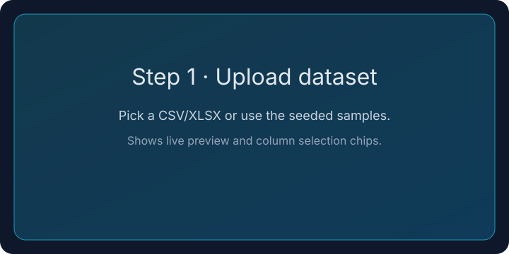
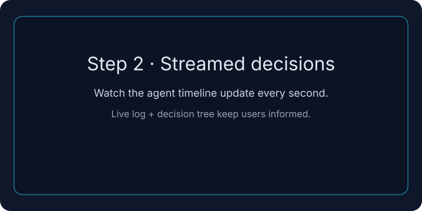

# Step-by-step analysis view (with exports)

A lightweight guide to the live analysis UI, seeded datasets, and export options.

## 1) Upload and preview

- Pick a CSV/XLSX or download a seeded sample (clinical_trial_sample.csv or marketing_uplift.csv) from the frontend quick links.
- The preview shows the first rows and lets you chip-select 2–4 columns for faster plots.
- Tooltips in the UI remind users about column limits and where to see live updates.

## 2) Watch streamed decisions

- Open the viewer to see live agent steps, p-values, and the execution log updating every second.
- The guided tour card in the UI links to the samples and outlines the four-step journey.
- Decision steps are persisted so the timeline does not reset when the model falls back.

## 3) Interpret results and export

- P-values, effect sizes, and visual diagnostics are rendered side-by-side for immediate context.
- Exports: click **Export PDF/Word/CSV** to pull a styled report (WeasyPrint/pdf + python-docx). CSV includes p-values and computed effect sizes when available.
- Plots are embedded in the PDF/Word output so stakeholders see the same visuals from the UI.

## Seeded example datasets
- `frontend/public/samples/clinical_trial_sample.csv` — placebo vs treatment with pre/post scores (Cohen's d is computed automatically).
- `frontend/public/samples/marketing_uplift.csv` — control vs variant revenue/orders for uplift testing.

## Implementation notes
- Export endpoints live under `/analysis/{id}/export/{pdf|docx|csv}` and reuse the same payload as the UI.
- WeasyPrint + python-docx are optional dependencies; the API returns a 503 with guidance if either is missing.
- Effect sizes are derived when a binary grouping column exists (Cohen's d) so they line up with the box/scatter plots in the report.
