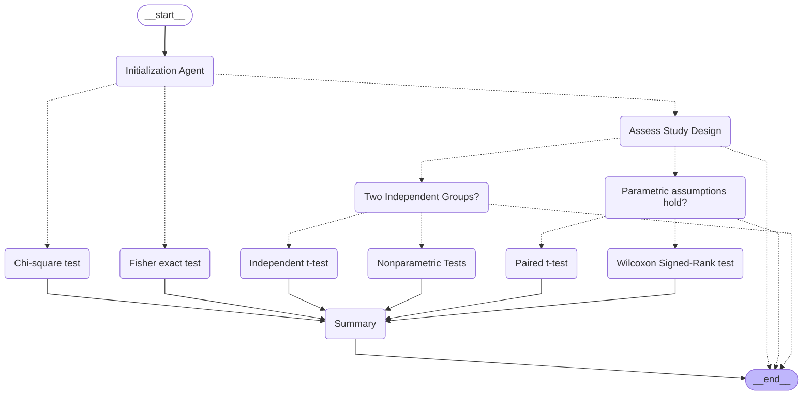

# StatmateAI Workflow Documentation

**LangGraph-Based Statistical Analysis Workflow**

---

## Overview

StatmateAI uses a LangGraph workflow to orchestrate the statistical analysis process. The workflow is a directed graph where each node represents a decision point or statistical test, and edges represent possible paths based on the data characteristics and study design.

---

## Workflow Graph



---

## Workflow Nodes Explained

### 1. **Initialization Agent**
**Type**: Entry Point  
**Purpose**: Analyzes the input dataset and determines the data type and study characteristics

**Actions**:
- Inspects DataFrame columns
- Identifies data types (continuous, categorical, ordinal)
- Determines number of groups/samples
- Checks for paired data structure
- Extracts metadata for downstream decisions

**Outputs**:
- `data_type`: "continuous", "categorical", or "mixed"
- `paired`: Boolean indicating if data is paired
- `number_of_samples`: Count of groups
- `target_columns`: Selected columns for analysis

**Next Steps**:
- **Continuous data** → `Assess_Study_Design`
- **Categorical data** → `Chi-square_test` or `Fisher_exact_test`

---

### 2. **Assess Study Design**
**Type**: Decision Node  
**Purpose**: Determines the appropriate path based on study design

**Decision Criteria**:
- **Paired measurements?** (same subjects, before/after)
  - Yes → Check `Parametric_assumptions_hold_`
- **Independent groups?** (different subjects)
  - Yes → Check `Two_Independent_Groups_`
- **Association/correlation?**
  - → Correlation tests (Pearson, Spearman)

**Agent Logic**:
- Uses LLM to interpret study design
- Considers domain knowledge
- Validates assumptions

---

### 3. **Parametric Assumptions Hold?**
**Type**: Decision Node  
**Purpose**: Checks if parametric test assumptions are met

**Checks Performed**:
1. **Normality**: Shapiro-Wilk test
2. **Homogeneity of variance**: Levene's test (for independent samples)
3. **Sample size**: Adequate for parametric tests

**Decision Logic**:
```python
if shapiro_wilk_p_value > 0.05:
    # Data appears normal
    → Paired_t-test
else:
    # Data is non-normal
    → Wilcoxon_Signed-Rank_test
```

**Outputs**:
- `normality_test_results`: p-values from normality tests
- `assumptions_met`: Boolean

---

### 4. **Paired t-test**
**Type**: Statistical Test Node  
**Purpose**: Compare means of two related groups (parametric)

**When Used**:
- Paired measurements (before/after, matched pairs)
- Data is normally distributed
- Continuous outcome variable

**Statistical Method**:
```python
from scipy.stats import ttest_rel
statistic, p_value = ttest_rel(group1, group2)
```

**Output**:
- t-statistic
- p-value
- Degrees of freedom
- Mean difference
- 95% confidence interval
- Interpretation

---

### 5. **Wilcoxon Signed-Rank Test**
**Type**: Statistical Test Node  
**Purpose**: Compare medians of two related groups (non-parametric)

**When Used**:
- Paired measurements
- Data is NOT normally distributed
- Continuous or ordinal outcome variable

**Statistical Method**:
```python
from scipy.stats import wilcoxon
statistic, p_value = wilcoxon(group1, group2)
```

**Output**:
- W-statistic
- p-value
- Median difference
- Interpretation

---

### 6. **Two Independent Groups?**
**Type**: Decision Node  
**Purpose**: Determines approach for independent samples

**Decision Criteria**:
- **Exactly 2 groups** + **Normal distribution** + **Equal variances**
  - → `Independent_t-test`
- **Non-normal OR unequal variances OR > 2 groups**
  - → `Nonparametric_Tests`

**Considerations**:
- Sample size in each group
- Variance homogeneity
- Distribution shape

---

### 7. **Independent t-test**
**Type**: Statistical Test Node  
**Purpose**: Compare means of two independent groups (parametric)

**When Used**:
- Two independent groups
- Data is normally distributed
- Equal or unequal variances (Student's or Welch's)

**Statistical Methods**:
```python
from scipy.stats import ttest_ind

# Student's t-test (equal variances)
statistic, p_value = ttest_ind(group1, group2, equal_var=True)

# Welch's t-test (unequal variances)
statistic, p_value = ttest_ind(group1, group2, equal_var=False)
```

**Output**:
- t-statistic
- p-value
- Degrees of freedom
- Mean difference
- 95% confidence interval
- Effect size (Cohen's d)

---

### 8. **Nonparametric Tests**
**Type**: Statistical Test Node  
**Purpose**: Compare groups without assuming normal distribution

**Tests Included**:

**Mann-Whitney U test** (2 independent groups):
```python
from scipy.stats import mannwhitneyu
statistic, p_value = mannwhitneyu(group1, group2)
```

**Kruskal-Wallis H test** (>2 independent groups):
```python
from scipy.stats import kruskal
statistic, p_value = kruskal(group1, group2, group3, ...)
```

**When Used**:
- Non-normal distribution
- Ordinal data
- Small sample sizes
- Unequal variances

**Output**:
- Test statistic (U or H)
- p-value
- Median differences
- Post-hoc tests (if >2 groups)

---

### 9. **Chi-square Test**
**Type**: Statistical Test Node  
**Purpose**: Test association between two categorical variables

**When Used**:
- Both variables are categorical
- Expected frequency ≥ 5 in all cells
- Large enough sample size

**Statistical Method**:
```python
from scipy.stats import chi2_contingency
chi2, p_value, dof, expected = chi2_contingency(contingency_table)
```

**Output**:
- Chi-square statistic
- p-value
- Degrees of freedom
- Expected frequencies
- Effect size (Cramér's V)

---

### 10. **Fisher Exact Test**
**Type**: Statistical Test Node  
**Purpose**: Test association between two categorical variables (small samples)

**When Used**:
- 2x2 contingency table
- Expected frequency < 5 in any cell
- Small sample sizes

**Statistical Method**:
```python
from scipy.stats import fisher_exact
odds_ratio, p_value = fisher_exact(contingency_table)
```

**Output**:
- Odds ratio
- p-value
- 95% confidence interval for odds ratio

---

### 11. **Summary**
**Type**: Aggregation Node  
**Purpose**: Compile all test results and generate final report

**Actions**:
1. Collect all test results from executed nodes
2. Extract p-values and statistics
3. Generate natural language summary using LLM
4. Create recommendations
5. Flag any methodological concerns

**Output Structure**:
```python
{
    "tests_performed": [
        {
            "test_name": "Paired t-test",
            "statistic": 3.45,
            "p_value": 0.002,
            "interpretation": "Significant difference (p < 0.05)"
        }
    ],
    "summary": "The analysis revealed...",
    "probabilities": {
        "paired_t_test": 0.002,
        "shapiro_wilk": 0.234
    },
    "recommendations": [
        "Results show strong evidence...",
        "Consider reporting effect size..."
    ]
}
```

---

## Workflow State

The workflow maintains state throughout execution:

```python
initial_state = {
    'df': pd.DataFrame,              # Input dataset
    'secondary_df': pd.DataFrame,    # Optional paired data
    'target_columns': list[str],     # Selected columns
    'paired': bool,                  # Paired design flag
    'data_type': str,                # "continuous", "categorical"
    'do_association': bool,          # Association analysis flag
    'number_of_samples': int,        # Number of groups
    'results': list[dict],           # Accumulated results
    'probabilities': dict[str, float], # p-values by test
}
```

---

## Edge Types

### Solid Edges (→)
**Meaning**: Direct path to next node  
**Example**: `Chi-square_test → Summary`  
**Usage**: Test results flow directly to summary

### Dashed Edges (-.->)
**Meaning**: Conditional routing based on decision  
**Example**: `Initialization_Agent -.-> Assess_Study_Design`  
**Usage**: Agent decides which path to take based on data

---

## Execution Flow Examples

### Example 1: Paired Comparison (Normal Data)

```
__start__
    ↓
Initialization_Agent
    ↓ (continuous, paired)
Assess_Study_Design
    ↓ (paired measurements)
Parametric_assumptions_hold_?
    ↓ (yes, normal)
Paired_t-test
    ↓
Summary
    ↓
__end__
```

### Example 2: Paired Comparison (Non-Normal Data)

```
__start__
    ↓
Initialization_Agent
    ↓ (continuous, paired)
Assess_Study_Design
    ↓ (paired measurements)
Parametric_assumptions_hold_?
    ↓ (no, non-normal)
Wilcoxon_Signed-Rank_test
    ↓
Summary
    ↓
__end__
```

### Example 3: Independent Groups Comparison

```
__start__
    ↓
Initialization_Agent
    ↓ (continuous, independent)
Assess_Study_Design
    ↓ (independent groups)
Two_Independent_Groups_?
    ↓ (yes, 2 groups)
Independent_t-test
    ↓
Summary
    ↓
__end__
```

### Example 4: Categorical Association

```
__start__
    ↓
Initialization_Agent
    ↓ (categorical)
Chi-square_test  (or Fisher_exact_test if small samples)
    ↓
Summary
    ↓
__end__
```

---

## Integration with API

The workflow is executed by `AnalysisService.run_analysis()`:

```python
from statmate.workflow.statmate_flow import compiled

def run_analysis(db: Session, analysis_id: str):
    # Load dataset
    df = DatasetService.load_dataset_dataframe(db, dataset_id)
    
    # Prepare initial state
    initial_state = {
        'df': df,
        'secondary_df': None,
        'target_columns': selected_columns or [],
        'paired': False,
        'data_type': None,
        'do_association': False,
        'number_of_samples': 0,
        'results': [],
        'probabilities': {},
    }
    
    # Execute workflow
    messages = []
    for msg, meta in compiled.stream(initial_state, stream_mode='messages'):
        messages.append(str(msg.content))
    
    # Extract final state
    final_state = compiled.get_state()
    results = final_state['results']
    probabilities = final_state['probabilities']
```

---

## Extending the Workflow

### Adding a New Test

1. **Create test function** in `statmate/statistical_core/`:
   ```python
   def my_new_test(data: pd.DataFrame) -> dict:
       # Implement test
       return result
   ```

2. **Create agent** in `statmate/agents/`:
   ```python
   my_test_agent = Agent(
       model='openai:gpt-4',
       system_prompt="You analyze data for..."
   )
   ```

3. **Add node to graph** in `statmate/workflow/statmate_flow.py`:
   ```python
   graph.add_node('my_new_test', my_test_node_function)
   graph.add_edge('previous_node', 'my_new_test')
   graph.add_edge('my_new_test', 'Summary')
   ```

4. **Update this documentation** with the new node description

---

## Workflow File Location

**Primary Implementation**: `statmate/workflow/statmate_flow.py`

**Key Components**:
- Node definitions
- Edge routing logic
- State management
- Compiled graph

**Related Files**:
- `statmate/agents/` - LLM agent definitions
- `statmate/statistical_core/` - Statistical test implementations

---

## Best Practices

### 1. Always Check Assumptions
The workflow automatically validates statistical assumptions before selecting tests.

### 2. Multiple Paths are Possible
The LangGraph structure allows the workflow to explore multiple analytical approaches when appropriate.

### 3. Interpretable Results
Every test output includes:
- Raw statistics
- p-values
- Effect sizes
- Natural language interpretation

### 4. Audit Trail
All decisions and test results are logged for reproducibility.

---

## Troubleshooting

### Workflow Stops Prematurely
**Possible Causes**:
- Missing required columns
- Invalid data types
- Insufficient sample size

**Solution**: Check `Initialization_Agent` output in logs

### Unexpected Test Selection
**Possible Causes**:
- Misclassified data type
- Incorrect study design interpretation

**Solution**: Review agent prompts and add explicit configuration

### No Results Generated
**Possible Causes**:
- All tests failed assumption checks
- Data quality issues

**Solution**: Check data preprocessing and normality test results

---

## Performance Considerations

- **LLM Calls**: Each agent node makes 1-2 LLM API calls
- **Statistical Tests**: CPU-bound, fast execution
- **Typical Duration**: 30-60 seconds for complete workflow
- **Optimization**: Cache LLM responses for repeated analyses

---

## Future Enhancements

Planned additions to the workflow:

- [ ] Regression analysis path (Linear, Logistic)
- [ ] Survival analysis (Kaplan-Meier, Cox)
- [ ] Multi-comparison adjustments (Bonferroni, Holm)
- [ ] Post-hoc tests (Tukey, Dunn)
- [ ] Effect size calculations (Cohen's d, Eta-squared)
- [ ] Power analysis
- [ ] Sample size recommendations
- [ ] Outlier detection and handling
- [ ] Missing data strategies

---

**For implementation details**, see:
- [Service Layer Documentation](SERVICE_LAYER.md) - AnalysisService integration
- [Implementation Guide](IMPLEMENTATION_GUIDE.md) - Backend integration
- Code: `statmate/workflow/statmate_flow.py`

---

**Last Updated**: October 16, 2025  
**Workflow Version**: 1.0

