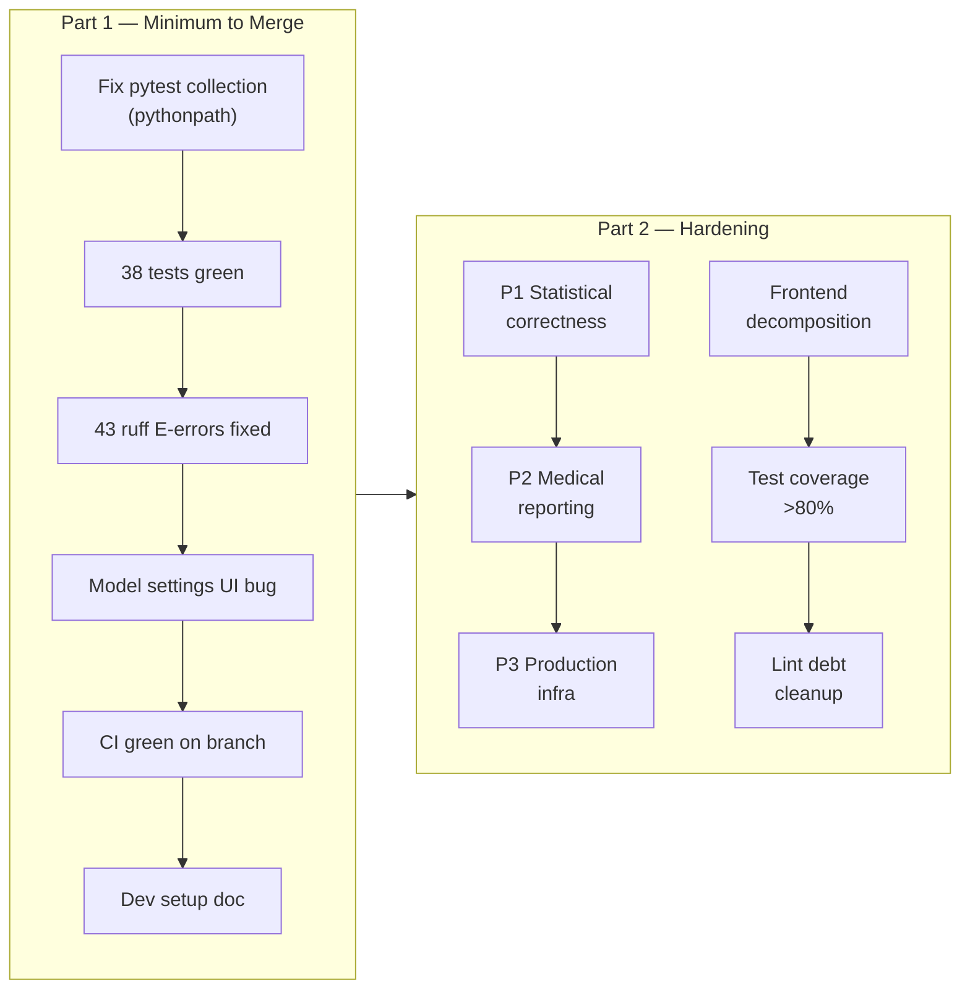

<!-- type: reference -->

# StatmateAI — Authoritative Roadmap

| Field    | Value                                                                                                                                                                |
| -------- | -------------------------------------------------------------------------------------------------------------------------------------------------------------------- |
| Date     | 2026-05-01                                                                                                                                                           |
| Owner    | Core product + AI workflow team                                                                                                                                      |
| Replaces | `TODO.md`, `docs/todo/master_ai_project_audit_and_roadmap.md`, `docs/todo/finalization_roadmap.md`, `plans/p0_execution_plan.md`, `plans/model_settings_fix_plan.md` |

---

## Current State

- **Test gate BLOCKED** — all 6 test files fail at collection (`ModuleNotFoundError: No module named 'statmate'`); root cause is missing `[tool.pytest.ini_options]` with `pythonpath = ["."]` in `pyproject.toml`.
- **Lint gate BLOCKED** — 43 ruff E-level errors (40× E501 line-too-long, 3× E402 import-not-at-top) across 11 files; CI will reject the branch.
- **P0 feature work is complete** — agent split, user-in-the-loop wiring, and assumption guardrail removal are merged; 38 tests were passing before the pythonpath regression.
- **Model settings UI bug** — provider dropdown exposes unconfigured providers; model dropdown shows all models regardless of configuration status.
- **Technical debt is real but bounded** — `App.tsx` ~1940 LOC, `nodes.py` ~1201 LOC; ~550 total ruff findings (43 E-level gate, remainder stylistic); coverage is thin across 6 test files.

---

## Phase overview

---

## Part 1: Minimum to Merge to Main

These are the only blockers for a safe, green PR into `main`. Nothing aspirational — if it is not here, it belongs in Part 2.

### 1.1 Fix pytest collection

- [ ] **What:** Add `[tool.pytest.ini_options]` section to `pyproject.toml` with `pythonpath = ["."]`.
- **Why it blocks merge:** All 6 test files fail at collection — CI cannot run any tests.
- **Acceptance criterion:** `uv run pytest -q` collects and begins executing all test files without import errors.

### 1.2 Verify test suite is green

- [ ] **What:** Run `uv run pytest -q` after the pythonpath fix and confirm all 38 tests pass.
- **Why it blocks merge:** A broken test suite means no confidence in correctness.
- **Acceptance criterion:** Exit code 0, output shows `38 passed`.

### 1.3 Fix 43 ruff E-level errors

- [ ] **What:** Fix E501 (line ≥ 120 chars) and E402 (module import not at top) across `workflow_graph_service.py`, `validation.py`, `anova.py`, `comparison.py`, `app.py`, `credentials.py`, `blueprint.py`, `graph_metadata.py`, `column_role_agent.py`, `methodology_auditor.py`, `nodes.py`.
- **Why it blocks merge:** `ci.yml` runs `ruff check --select E` as a hard gate.
- **Acceptance criterion:** `uv run ruff check statmate tests --select E` exits 0 with 0 findings.

### 1.4 Fix model settings UI bug

- [ ] **What (Change 1):** In `frontend/src/App.tsx`, replace the `providerOptions` memo so it returns `configuredProviders` directly (with a fallback) instead of merging all model providers.
- [ ] **What (Change 2):** In `frontend/src/App.tsx` line ~269, change `api.availableModels(true)` → `api.availableModels(false)` so only models from configured providers are fetched.
- **Why it blocks merge:** Users can select unconfigured providers, causing runtime LLM-call failures.
- **Acceptance criterion:** Provider dropdown shows only providers with API keys set; model dropdown lists only models for the selected configured provider.

### 1.5 Verify CI workflow passes

- [ ] **What:** Push the branch; confirm `.github/workflows/ci.yml` runs green (pytest + ruff E gate).
- **Why it blocks merge:** Main branch protection requires a passing CI check.
- **Acceptance criterion:** All CI steps show green on the PR.

### 1.6 Document one-line setup command

- [ ] **What:** Ensure `README.md` (or `docs/setup/QUICK_START.md`) contains the canonical new-developer setup command: `uv sync --all-extras && uv run pytest`.
- **Why it blocks merge:** Without it, contributors will hit the same pythonpath issue.
- **Acceptance criterion:** The command is present, accurate, and produces a green test run on a fresh clone.

---

## Part 2: Hardening and Productionalization

### Statistical correctness `[P1]`

- `[P1]` Standardize effect sizes and 95% CIs across all test families — target files: `statmate/statistical_core/comparison.py`, `anova.py`, `categorical_comparison.py`, `linear_correlation.py`. Create shared helpers in `statmate/statistical_core/effect_size.py`.
- `[P1]` Add post-hoc power interpretation for non-significant results — update summarizer prompt and result model.
- `[P1]` Implement regression module (`linear`, `multiple` with VIF, `logistic`) in `statmate/statistical_core/regression.py`; wire as new branch in route engine.
- `[P1]` Add outlier/influence diagnostics (Cook's distance, leverage, VIF) to blueprint construction in `statmate/workflow/blueprint.py`.
- `[P1]` Resolve `cox_regression` placeholder — implement minimally or hard-disable the route with a user-facing message.

### Medical reporting quality `[P2]`

- `[P2]` Enforce structured Finding/Evidence/Caveat format in summarizer output; add reviewer check for missing clinical significance block.
- `[P2]` Add reviewer enforcement for CI/effect-size presence — reviewer must fail-soft (flag, not error) when these are absent.
- `[P2]` Add multiplicity check to reviewer agent for multi-group comparisons (Bonferroni/FDR flag).
- `[P2]` Add chart narrative captions explaining what each visualization shows in plain clinical language.

### Production infrastructure `[P3]`

- `[P3]` Replace FastAPI `BackgroundTasks` with a durable worker queue (Celery or Temporal); wire task status persistence to DB.
- `[P3]` Implement real scheduled-task parsing — replace `datetime.utcnow()` mock in scheduler service.
- `[P3]` Add API rate-limiting middleware (e.g., `slowapi`) with per-user quotas.
- `[P3]` Implement policy-driven PII modes (strict / balanced / permissive) with per-tenant audit report.
- `[P3]` Add data retention/TTL enforcement — auto-delete upload and result rows after configurable period.

### Frontend `[P2/P3]`

- `[P2]` Decompose `frontend/src/App.tsx` (~1940 LOC) into focused components; set a hard 400-LOC limit per file.
- `[P2]` Add Playwright end-to-end smoke test for the happy-path analysis flow.
- `[P3]` Implement guided UX wizard: column type-casting, assumption stoplights, "why this test?" explainer.
- `[P3]` Make a documented decision on primary UI strategy (React vs Streamlit) and deprecate the secondary path.

### Test coverage `[P1]`

- `[P1]` Target >80% line coverage on `statmate/statistical_core/` and `statmate/workflow/` via `pytest-cov`; add coverage report to CI.
- `[P1]` Add integration tests for the full analysis workflow end-to-end (file upload → result export).

### Lint debt `[P2]`

- `[P2]` After E-level gate is clean, address the remaining ~507 ruff findings (W, C, ANN categories) in a dedicated cleanup PR — do not mix with feature work.
- `[P2]` Set `[tool.ruff.lint] select = ["E", "W", "C90"]` in `pyproject.toml` to prevent regression once cleaned.

### Architecture notes

- **MCP adoption:** Adopt Model Context Protocol for tool/data access contracts after Part 1 is merged; do not attempt before the test gate is stable.
- **A2A protocol:** Defer agent-to-agent protocol adoption until the MCP layer is validated; premature adoption adds integration risk with no near-term payoff.
- **`nodes.py` decomposition:** Break `statmate/workflow/nodes.py` (~1201 LOC) into per-phase modules alongside the P1 statistical correctness work — the two refactors share the same call boundaries.
