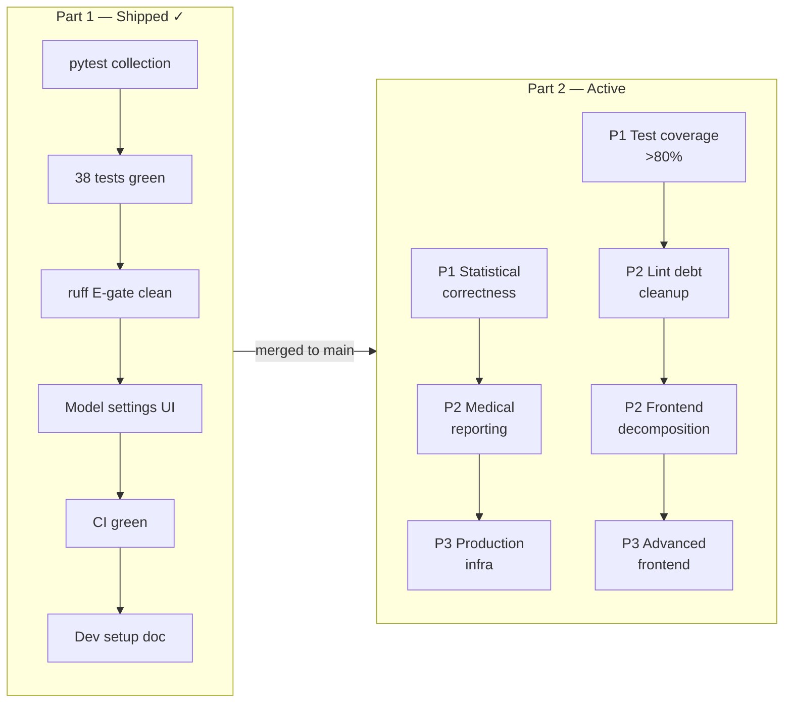

<!-- type: reference -->
# StatmateAI — Authoritative Roadmap

| Field    | Value                                                                                                                                                                |
| -------- | -------------------------------------------------------------------------------------------------------------------------------------------------------------------- |
| Date     | 2026-05-01                                                                                                                                                           |
| Owner    | Core product + AI workflow team                                                                                                                                      |
| Status   | **Part 1 shipped — Part 2 active**                                                                                                                                   |
| Replaces | `TODO.md`, `docs/todo/master_ai_project_audit_and_roadmap.md`, `docs/todo/finalization_roadmap.md`, `plans/p0_execution_plan.md`, `plans/model_settings_fix_plan.md` |

---

> [!IMPORTANT]
> **Scope (binding).** The active work is **Part 2 — Hardening and Productionalization**, spanning statistical correctness, medical reporting quality, production infrastructure, frontend decomposition, test coverage, and lint debt.
> Part 1 (pytest collection, ruff E-gate, model settings UI, CI, dev setup doc) is **shipped and closed** — do not reopen or amend Part 1 items.

> [!NOTE]
> **Gate before advancing.** Each priority group (P1 → P2 → P3) must pass `uv run pytest -q` and `uv run ruff check` before the next group begins. Do not mix priority groups in a single PR. P1 items are prerequisites for P2; P2 items are prerequisites for P3.

**Shipped baseline:** 38 tests green · ruff E-gate clean · model settings UI fixed · CI green · dev setup documented.

**Part 2 — P1 wave shipped (2026-05-01):** 62 tests green · P2-F00 (effect sizes & 95% CIs) · P2-F01 (post-hoc power interpretation) · P2-F02 (regression module: linear, multiple+VIF, logistic) · P2-F03 (outlier/influence diagnostics) · P2-F04 (Cox regression hard-disabled, HTTP 501).

**Part 2 — P2 medical-reporting slice shipped (2026-05-01):** P2-F08 (structured Finding/Evidence/Caveat output + reviewer missing-structure flags) · P2-F09 (reviewer CI/effect-size fail-soft flags) · P2-F10 (Bonferroni multiplicity warning) · P2-F11 (chart narrative captions). Validation: repo-wide `pytest -q` passed; repo-wide `ruff` remains blocked by existing lint debt; `ty` is unavailable in this environment.

---

## Phase overview



---

## Planning principles

| Principle             | Implication                                                                                                                                                                                         |
| --------------------- | --------------------------------------------------------------------------------------------------------------------------------------------------------------------------------------------------- |
| Additive only         | Existing API models, database columns, and Pydantic field shapes are preserved. No field rename or removal without a migration and version bump.                                                    |
| Agent determinism     | LLM agent prompts and structured outputs must produce consistent test selections and summaries for equivalent inputs; use temperature=0 and structured output where possible.                       |
| Assumption integrity  | Every statistical test recommendation must be gated by assumption validation; no test result is emitted without a corresponding assumption log entry.                                               |
| Regression visibility | Every agent or statistical-core change must appear as an updated test fixture or snapshot, not a silent output flip.                                                                                |
| Statistical honesty   | Output fields distinguish test result from interpretation. P-values, effect sizes, and confidence intervals are emitted as structured fields, never only embedded in prose.                         |
| SOLID + Hexagonal     | All code follows SOLID (see Architecture section below). All new surfaces respect the hexagonal layer map: domain never imports adapters, routes are thin, ports live in `core/base_interfaces.py`. |

---

## Architecture — Hexagonal (Ports & Adapters), mandatory

The project uses **Hexagonal Architecture** as the single, non-negotiable structural pattern. All contributors must understand the layer map before writing code:

```
┌─────────────────────────────────────────────────────────┐
│  Inbound adapters                                       │
│  statmate/api/routes/   frontend/src/   statmate/ui/    │
├─────────────────────────────────────────────────────────┤
│  Application services (orchestrate domain)              │
│  statmate/api/services/   statmate/workflow/            │
├─────────────────────────────────────────────────────────┤
│  Domain (pure, no I/O)                                  │
│  statmate/statistical_core/   statmate/agents/          │
│  Ports defined in: statmate/core/base_interfaces.py     │
├─────────────────────────────────────────────────────────┤
│  Outbound adapters                                      │
│  database/   statmate/api/scheduler/   LLM providers    │
└─────────────────────────────────────────────────────────┘
```

**Layer rules (violations block merge):**

- Domain (`statistical_core/`, `agents/`) **must not import** from `statmate/api/`, `database/`, or any I/O layer. Dependency direction is always inward.
- Application services import domain and outbound adapters; they **never** import from `statmate/api/routes/`.
- Ports (new protocols or ABCs) belong in `statmate/core/base_interfaces.py`. Concrete adapters implement those ports and live in the adapter layer.
- Routes are **thin**: validate HTTP input, call one service method, return a Pydantic response. No business logic, no direct DB access.
- Database schema changes require a migration SQL file in `database/migrations/` with a descriptive filename; no ORM model mutation without a matching migration.
- LangGraph workflow changes (nodes, edges, state fields) must update `statmate/workflow/graph_metadata.py` and the corresponding `tests/test_workflow_graph_metadata.py` fixture.
- Frontend changes live exclusively under `frontend/src/`; no Python files are modified in a frontend-only PR.

### SOLID — mandatory, with codebase enforcement points

Every code change is reviewed against all five principles. Violations are reported as blocking concerns by `rubber_duck`.

| Principle                     | Enforcement rule                                                                                                                                                                                   | Codebase location                       |
| ----------------------------- | -------------------------------------------------------------------------------------------------------------------------------------------------------------------------------------------------- | --------------------------------------- |
| **S** — Single Responsibility | Each module/class does one thing. Agents handle one statistical concern; services handle one workflow stage; routes handle one resource. Split when a class has more than one reason to change.    | All layers                              |
| **O** — Open/Closed           | New statistical tests are new modules in `statmate/statistical_core/`; new agents are new files in `statmate/agents/`. Existing modules are not modified to accommodate a new test type.           | `statistical_core/`, `agents/`          |
| **L** — Liskov Substitution   | All implementations of `StatisticalTest`, `DataTransformer`, and any ABC in `statmate/core/base_interfaces.py` must be substitutable for their base type without changing program correctness.     | `core/base_interfaces.py`               |
| **I** — Interface Segregation | Protocols are small and role-specific (`StatisticalTest` is separate from `DataTransformer`). No agent or service is forced to implement methods it does not use. New ports are narrow by default. | `core/base_interfaces.py`               |
| **D** — Dependency Inversion  | Routes depend on service abstractions injected via FastAPI `Depends()`; services depend on port interfaces, not concrete DB or file-system classes. No infrastructure imports in domain modules.   | `statmate/api/dependencies.py`, `core/` |

> [!IMPORTANT]
> If a new class cannot be placed cleanly within the hexagonal layer map, or if it violates a SOLID principle, the correct response is to redesign — not to add an exception. Raise an open question before implementation begins.

---

## Part 2 feature inventory

| ID     | Feature                                                                                                               | Priority | Area                    | Status        |
| ------ | --------------------------------------------------------------------------------------------------------------------- | -------- | ----------------------- | ------------- |
| P2-F00 | Effect sizes and 95% CIs across all test families; shared `effect_size.py` helper                                     | P1       | Statistical correctness | **Shipped ✓** |
| P2-F01 | Post-hoc power interpretation for non-significant results — update summarizer prompt and result model                 | P1       | Statistical correctness | **Shipped ✓** |
| P2-F02 | Regression module (`linear`, `multiple` with VIF, `logistic`) in `statistical_core/regression.py`; wire into workflow | P1       | Statistical correctness | **Shipped ✓** |
| P2-F03 | Outlier/influence diagnostics (Cook's distance, leverage, VIF) in `workflow/blueprint.py`                             | P1       | Statistical correctness | **Shipped ✓** |
| P2-F04 | Resolve `cox_regression` placeholder — implement minimally or hard-disable with `501` + user-facing message           | P1       | Statistical correctness | **Shipped ✓** |
| P2-F05 | Decompose `statmate/workflow/nodes.py` (~1201 LOC) into per-phase modules; 400-LOC hard limit per file                | P1       | Architecture            | **Shipped ✓** |
| P2-F06 | >80% line coverage on `statistical_core/` and `workflow/` via `pytest-cov`; coverage report in CI                     | P1       | Test coverage           | Not started   |
| P2-F07 | Integration tests for full analysis workflow (file upload → result export)                                            | P1       | Test coverage           | Not started   |
| P2-F08 | Structured Finding/Evidence/Caveat format in summarizer; reviewer check for missing clinical significance block       | P2       | Medical reporting       | **Shipped ✓** |
| P2-F09 | Reviewer enforcement for CI/effect-size presence (fail-soft: flag, not error)                                         | P2       | Medical reporting       | **Shipped ✓** |
| P2-F10 | Multiplicity check in reviewer agent for multi-group comparisons (Bonferroni/FDR flag)                                | P2       | Medical reporting       | **Shipped ✓** |
| P2-F11 | Chart narrative captions in plain clinical language                                                                   | P2       | Medical reporting       | **Shipped ✓** |
| P2-F12 | Decompose `frontend/src/App.tsx` (~1940 LOC) into focused components; 400-LOC hard limit per file                     | P2       | Frontend                | Not started   |
| P2-F13 | Playwright end-to-end smoke test for happy-path analysis flow                                                         | P2       | Frontend                | Not started   |
| P2-F14 | Address ~507 ruff W/C/ANN findings in a dedicated cleanup PR — do not mix with feature work                           | P2       | Lint debt               | Not started   |
| P2-F15 | Set `select = ["E", "W", "C90"]` in `pyproject.toml` to lock in lint gate after cleanup                               | P2       | Lint debt               | Not started   |
| P2-F16 | Replace `BackgroundTasks` with durable worker queue (Celery or Temporal); wire task status persistence to DB          | P3       | Production infra        | Not started   |
| P2-F17 | Implement real scheduled-task parsing — replace `datetime.utcnow()` mock in scheduler service                         | P3       | Production infra        | Not started   |
| P2-F18 | API rate-limiting middleware (`slowapi`) with per-user quotas                                                         | P3       | Production infra        | Not started   |
| P2-F19 | Policy-driven PII modes (strict / balanced / permissive) with per-tenant audit report                                 | P3       | Production infra        | Not started   |
| P2-F20 | Data retention/TTL enforcement — auto-delete upload and result rows after configurable period                         | P3       | Production infra        | Not started   |
| P2-F21 | Guided UX wizard: column type-casting, assumption stoplights, "why this test?" explainer                              | P3       | Frontend                | Not started   |
| P2-F22 | Documented decision on primary UI strategy (React vs Streamlit); deprecate secondary path                             | P3       | Frontend                | Not started   |

---

## Part 2: Feature detail

Each section below gives a junior developer enough context to implement the feature independently. Read the **Context** block before touching any file. The **Steps** are ordered — do not skip or reorder them. After finishing each step, run `uv run pytest -q` to confirm you have not broken existing tests.

---

### P2-F00 — Effect sizes and 95% CIs across all test families

**Status:** Shipped ✓ (2026-05-01) | **Priority:** P1 | **Area:** Statistical correctness

**Context.**
`StatTestResult` (defined in `statmate/statistical_core/base.py`) already has two optional fields:
- `effect_size_type: str | None` — the name of the effect-size metric (e.g. `"cohen_d"`)
- `confidence_interval: list[float] | None` — `[lower, upper]`, exactly 2 elements

These fields exist but are not populated by most test functions. The goal is to create a single shared helper module so every test family fills both fields consistently.

**Files to create:**
- `statmate/statistical_core/effect_size.py` (new — the only place effect-size math lives)

**Files to modify:**
- `statmate/statistical_core/comparison.py` — 5 functions: `ttest_rel_test`, `wilcoxon_test`, `ttest_ind_test`, `mannwhitneyu_test`, `welch_t_test`
- `statmate/statistical_core/anova.py` — one-way ANOVA, Kruskal-Wallis, Friedman
- `statmate/statistical_core/linear_correlation.py` — Pearson, Spearman
- `statmate/statistical_core/categorical_comparison.py` — chi-square, Fisher, McNemar

**Steps:**

1. **Create `statmate/statistical_core/effect_size.py`.** Add the following pure functions — no imports from `statmate/api`, `database`, or any I/O layer:

   ```python
   import numpy as np
   from scipy import stats

   def cohen_d(a: np.ndarray, b: np.ndarray) -> float:
       """Pooled-SD Cohen's d for two independent samples."""
       n1, n2 = len(a), len(b)
       pooled = np.sqrt(((n1 - 1) * np.var(a, ddof=1) + (n2 - 1) * np.var(b, ddof=1)) / (n1 + n2 - 2))
       return float((np.mean(a) - np.mean(b)) / pooled)

   def hedges_g(a: np.ndarray, b: np.ndarray) -> float:
       """Bias-corrected Cohen's d (Hedges' g)."""
       d = cohen_d(a, b)
       n = len(a) + len(b)
       correction = 1 - (3 / (4 * n - 9))
       return float(d * correction)

   def eta_squared(f_stat: float, df_between: int, df_within: int) -> float:
       """Eta-squared from one-way ANOVA F-statistic."""
       ss_between = f_stat * df_between
       return float(ss_between / (ss_between + df_within))

   def rank_biserial(u_stat: float, n1: int, n2: int) -> float:
       """Rank-biserial correlation for Mann-Whitney U."""
       return float(1 - (2 * u_stat) / (n1 * n2))

   def ci_mean_diff(a: np.ndarray, b: np.ndarray, alpha: float = 0.05) -> list[float]:
       """95% CI for the difference in means (Welch's method)."""
       result = stats.ttest_ind(a, b, equal_var=False)
       se = np.sqrt(np.var(a, ddof=1) / len(a) + np.var(b, ddof=1) / len(b))
       df = result.df  # type: ignore[union-attr]
       t_crit = stats.t.ppf(1 - alpha / 2, df=df)
       diff = float(np.mean(a) - np.mean(b))
       return [diff - t_crit * se, diff + t_crit * se]

   def ci_pearson(r: float, n: int, alpha: float = 0.05) -> list[float]:
       """Fisher Z-transform CI for Pearson r."""
       z = np.arctanh(r)
       se = 1 / np.sqrt(n - 3)
       z_crit = stats.norm.ppf(1 - alpha / 2)
       return [float(np.tanh(z - z_crit * se)), float(np.tanh(z + z_crit * se))]
   ```

2. **Update `comparison.py`.** In each of the 5 test functions, import from `effect_size` and set both fields on the returned `StatTestResult`:
   - `ttest_ind_test` and `welch_t_test`: use `hedges_g(data1, data2)` → `effect_size_type = "hedges_g"`; use `ci_mean_diff(data1, data2, alpha)` → `confidence_interval`.
   - `ttest_rel_test`: Cohen's d on paired differences (`data1 - data2`).
   - `mannwhitneyu_test`: use `rank_biserial(u_stat, len(data1), len(data2))` → `effect_size_type = "rank_biserial_r"`.
   - `wilcoxon_test`: rank-biserial on signed ranks (use `scipy.stats.wilcoxon` `zstatistic` divided by `sqrt(n*(n+1)/2)` approximation; label `effect_size_type = "rank_biserial_r"`).

3. **Update `anova.py`.** After an ANOVA F-test, compute `eta_squared(f_stat, df_between, df_within)` → `effect_size_type = "eta_squared"`. `confidence_interval` is not meaningful for ANOVA; leave it `None`.

4. **Update `linear_correlation.py`.** Use `ci_pearson(r, n, alpha)` for Pearson; for Spearman, use the same Fisher-Z approximation and label `effect_size_type = "spearman_rho"`.

5. **Update `categorical_comparison.py`.** Chi-square Cramér's V and Fisher Phi are already computed in categorical tests; ensure they are assigned to `effect_size_type` in `StatTestResult`. McNemar: use odds-ratio with `math.log` (no CI formula standardised; leave `confidence_interval = None`, label `effect_size_type = "odds_ratio"`).

6. **Write unit tests** in `tests/test_statistical_methods_expansion.py`. For each test function, assert:
   - `result.effect_size_type is not None`
   - `result.confidence_interval is None or len(result.confidence_interval) == 2`
   - `result.confidence_interval[0] <= result.confidence_interval[1]` when populated

**Acceptance test:** `uv run pytest tests/test_statistical_methods_expansion.py -q` passes; no `StatTestResult` in `statistical_core/` is returned with `effect_size_type = None` for the covered test families.

---

### P2-F01 — Post-hoc power interpretation for non-significant results

**Status:** Shipped ✓ (2026-05-01) | **Priority:** P1 | **Area:** Statistical correctness

**Context.**
When a test returns `p_value > alpha`, the current summarizer says the result is "not significant" but does not tell the clinician whether the study was powered to detect a meaningful effect. A post-hoc power note prevents the common misinterpretation of "not significant" as "no effect".

**Files to modify:**
- `statmate/agents/summarizer_agent.py`

**Steps:**

1. **Add `power_interpretation` field to `SummariserResults`:**

   ```python
   class SummariserResults(BaseModel):
       summary: str
       recommendations: str
       performed_tests: list[str]
       power_interpretation: str | None = None  # NEW — populated only when p > alpha
   ```

2. **Update the system prompt** in `summarizer_agent.py`. Add a paragraph after the existing instructions:

   > When one or more reported p-values exceed the significance threshold (p > alpha, typically 0.05), populate `power_interpretation` with a plain-language note. The note must: (a) state that a non-significant result does not confirm the null hypothesis; (b) reference the observed effect size (from the test result fields) and explain whether it suggests a clinically meaningful difference; (c) advise the reader to interpret the result in the context of sample size and study power. Do not compute power numerically — describe it qualitatively from the effect size magnitude. If all results are significant, set `power_interpretation` to null.

3. **Do not change any other agent, route, or service.** The new field is optional with `None` default, so existing consumers continue to work unchanged.

4. **Add a unit test** that creates a mock `SummariserDeps` with a non-significant p-value (e.g. `p=0.45`) in the result list and asserts that `SummariserResults.power_interpretation` is not `None` after the agent runs. Use `pydantic-ai`'s `TestModel` or a fixture that calls the agent with a mocked LLM response.

**Acceptance test:** `uv run pytest -q` green; `SummariserResults.power_interpretation` is a non-empty string when any `p_value > 0.05` is present in the input.

---

### P2-F02 — Regression module (linear, multiple with VIF, logistic)

**Status:** Shipped ✓ (2026-05-01) | **Priority:** P1 | **Area:** Statistical correctness

**Context.**
No `statmate/statistical_core/regression.py` exists yet. The module must follow the same pattern as `comparison.py`: pure functions, no I/O, returning `StatTestResult`. After creating it, wire it into the workflow as a new node so the routing engine can send regression-typed blueprints to it.

**Files to create:**
- `statmate/statistical_core/regression.py`

**Files to modify:**
- `statmate/workflow/nodes.py` (or its decomposed replacement from P2-F05) — add `regression_node`
- `statmate/workflow/blueprint.py` — detect regression intent in `DataBlueprint`
- `statmate/workflow/graph_metadata.py` — register the new node
- `tests/test_workflow_graph_metadata.py` — update fixture

**Steps:**

1. **Create `statmate/statistical_core/regression.py`** with three functions:

   ```python
   import numpy as np
   import pandas as pd
   from statsmodels.regression.linear_model import OLS
   from statsmodels.tools import add_constant
   from statsmodels.stats.outliers_influence import variance_inflation_factor
   from sklearn.linear_model import LogisticRegression
   from statmate.statistical_core.base import StatTestResult

   def linear_regression(X: pd.DataFrame, y: pd.Series, alpha: float = 0.05) -> StatTestResult:
       """Simple or multiple OLS regression via statsmodels."""
       ...

   def multiple_regression_with_vif(X: pd.DataFrame, y: pd.Series, alpha: float = 0.05) -> StatTestResult:
       """OLS regression; adds VIF for each predictor to test_specifics."""
       # Compute VIF: {col: variance_inflation_factor(X_const.values, i)}
       # Add vif_table to test_specifics dict on the returned StatTestResult
       ...

   def logistic_regression(X: pd.DataFrame, y: pd.Series, alpha: float = 0.05) -> StatTestResult:
       """Binary logistic regression via sklearn; returns log-odds coefficients and OR CIs."""
       ...
   ```

   Return type for all three is `StatTestResult`. Set:
   - `test_name` = `"linear_regression"` / `"multiple_regression"` / `"logistic_regression"`
   - `statistics` = F-statistic (linear/multiple) or model chi-square (logistic)
   - `p_value` = p-value of the overall model F-test or LR chi-square
   - `null_hypothesis` = `"All regression coefficients are zero."`
   - `effect_size_type` = `"r_squared"` (linear/multiple) or `"nagelkerke_r2"` (logistic)
   - `test_specifics` = full coefficient table as a dict (OLS summary values or logistic coefs + OR + p-values)

2. **Add a regression intent field to `DataBlueprint`** in `blueprint.py`:

   ```python
   regression_intent: Literal["none", "linear", "logistic"] = "none"
   ```

   In `build_data_blueprint()`, detect `regression_intent` from the raw agent payload: if the blueprint contains a continuous target with multiple continuous predictors, set `"linear"`; if the target is binary, set `"logistic"`.

3. **Add `regression_node` to `nodes.py`** (or the decomposed equivalent). The node reads `regression_intent` from `state["blueprint"]` and calls the appropriate function from `regression.py`. Store the result in `state["test_results"]` under key `"regression"`.

4. **Register the node in `graph_metadata.py`**:

   ```python
   WorkflowNode(id="regression_node", label="Regression Analysis", kind="analysis", transitions=["summariser_node"])
   ```

5. **Update `tests/test_workflow_graph_metadata.py`** — add `"regression_node"` to the node fixture list.

6. **Write regression unit tests** in a new file `tests/test_regression.py`:
   - `linear_regression` with a synthetic `y = 2*x + noise` returns `p_value < 0.05` and `effect_size_type == "r_squared"`.
   - `multiple_regression_with_vif` returns `test_specifics` containing `"vif_table"` with one entry per predictor.
   - `logistic_regression` on a perfectly separable binary problem returns a coefficient with the correct sign.

**Acceptance test:** `uv run pytest tests/test_regression.py -q` passes; `uv run pytest tests/test_workflow_graph_metadata.py -q` passes.

---

### P2-F03 — Outlier and influence diagnostics

**Status:** Shipped ✓ (2026-05-01) | **Priority:** P1 | **Area:** Statistical correctness

**Context.**
The `DataBlueprint` model in `statmate/workflow/blueprint.py` carries distribution metrics and sample balance but has no outlier or influence diagnostics. These should be computed once during blueprint construction and surfaced in `test_specifics` of subsequent test nodes, so agents can mention leverage/Cook's distance in their narratives without re-computing.

**Files to modify:**
- `statmate/workflow/blueprint.py`

**Steps:**

1. **Add a new Pydantic model** in `blueprint.py`:

   ```python
   class InfluenceDiagnostics(BaseModel):
       cooks_distance_max: float | None = None      # max Cook's D across all observations
       high_leverage_count: int | None = None        # obs with leverage > 2*(k+1)/n
       outlier_count_iqr: int | None = None          # obs outside 1.5*IQR fence
       vif_warnings: list[str] = []                  # predictor names with VIF > 5
   ```

2. **Add the field to `DataBlueprint`:**

   ```python
   class DataBlueprint(BaseModel):
       ...
       influence_diagnostics: InfluenceDiagnostics | None = None  # NEW
   ```

3. **Populate in `build_data_blueprint()`:**

   ```python
   from statsmodels.stats.outliers_influence import OLSInfluence, variance_inflation_factor
   from statsmodels.regression.linear_model import OLS
   from statsmodels.tools import add_constant
   import numpy as np

   def _compute_influence(df: pd.DataFrame, target_col: str) -> InfluenceDiagnostics:
       # Only compute if there are ≥ 2 numeric predictors and a continuous target
       # OLS fit → OLSInfluence → cooks_distance, hat_matrix_diag
       # Return InfluenceDiagnostics with computed values; return InfluenceDiagnostics() if too few columns
       ...
   ```

   Call `_compute_influence` and assign the result to `blueprint.influence_diagnostics` inside `build_data_blueprint()`. Wrap in `try/except` so a computation error does not abort blueprint construction — log the error and leave the field `None`.

4. **No route, service, or agent changes needed** for this feature. Influence diagnostics are available in the blueprint state for agents that choose to reference them.

5. **Write a unit test** in `tests/test_validation_design.py` (or a new `tests/test_blueprint.py`):
   - Build a `DataBlueprint` from a synthetic DataFrame with one obvious outlier.
   - Assert `blueprint.influence_diagnostics is not None`.
   - Assert `blueprint.influence_diagnostics.outlier_count_iqr >= 1`.

**Acceptance test:** `uv run pytest -q` passes; `DataBlueprint` with a numeric target column always populates `influence_diagnostics` (not `None`) when ≥ 2 numeric columns are present.

---

### P2-F04 — Resolve `cox_regression` placeholder

**Status:** Shipped ✓ (2026-05-01, hard-disable path) | **Priority:** P1 | **Area:** Statistical correctness

**Context.**
`cox_regression_node` in `statmate/workflow/nodes.py` (around line 1344–1351) is a stub. It currently exists in the graph but does nothing meaningful. The decision recorded in Open Question 1 must be resolved first; pending that decision, implement the hard-disable path described below.

**Files to modify:**
- `statmate/workflow/nodes.py` (or its decomposed replacement)
- `statmate/api/routes/analysis.py` (add a machine-readable error code to the response)

**Steps (hard-disable path — default until Open Question 1 is answered):**

1. **Replace the stub body** of `cox_regression_node` with:

   ```python
   def cox_regression_node(state: dict[str, Any]) -> dict[str, Any]:
       """Cox proportional hazards regression — not yet implemented."""
       return {
           **state,
           "error_message": (
               "Survival analysis (Cox regression) is not yet supported in this version. "
               "Please use a dedicated survival analysis tool or contact the team to prioritise this feature."
           ),
           "status": "NOT_IMPLEMENTED",
       }
   ```

2. **In the workflow graph edge** that leads to `cox_regression_node`, add a guard: if `state.get("status") == "NOT_IMPLEMENTED"`, route to `user_intervention_node` instead of `summariser_node`. This surfaces the message to the user rather than silently failing.

3. **In `statmate/api/routes/analysis.py`**, if the analysis result contains `status == "NOT_IMPLEMENTED"`, return HTTP `501` with a JSON body:

   ```json
   {"detail": "Survival analysis (Cox regression) is not yet implemented.", "code": "NOT_IMPLEMENTED"}
   ```

4. **Write a unit test** that calls `cox_regression_node` with a mock state and asserts `result["status"] == "NOT_IMPLEMENTED"` and `result["error_message"]` is a non-empty string.

**Acceptance test:** A request that triggers the Cox regression branch returns HTTP 501 with `code = "NOT_IMPLEMENTED"`; existing 38 tests remain green.

---

### P2-F05 — Decompose `statmate/workflow/nodes.py`

**Status:** Not started | **Priority:** P1 | **Area:** Architecture

**Context.**
`statmate/workflow/nodes.py` is ~1,200 LOC. The 400-LOC hard limit applies. The hexagonal rule says application services orchestrate domain — `nodes.py` is an application service layer. The split must keep all public node functions importable from `statmate.workflow.nodes` (existing imports must not break).

**Files to create:**
- `statmate/workflow/nodes_init.py` — `call_initialization_agent`, `design_verification_node`, `design_reconciliation_node`, `assess_study_design_node`
- `statmate/workflow/nodes_comparison.py` — `two_independent_node`, `nonparametric_node`, `mcnemar_node`
- `statmate/workflow/nodes_anova.py` — `anova_assumptions_node`, `anova_one_way_node`, `kruskal_wallis_node`, `anova_rm_node`, `friedman_node`
- `statmate/workflow/nodes_summary.py` — `summariser_node`, `reviewer_node`, `methodology_auditor_node`
- `statmate/workflow/nodes_routing.py` — `intent_discovery_node`, `choice_node`, `user_intervention_node`, `descriptive_summary_node`, `cox_regression_node`

**Files to modify:**
- `statmate/workflow/nodes.py` — becomes a re-export shim only

**Steps:**

1. **Identify private helpers** (prefixed `_`) used by each group of nodes. Move each private helper into the module that exclusively uses it. If a helper is shared by multiple modules, put it in a new `statmate/workflow/_node_helpers.py` (leading underscore signals it is internal).

2. **Create each new module.** Copy the relevant functions verbatim. Add the import of `_node_helpers` where needed. Do not change function signatures.

3. **Rewrite `nodes.py` as a re-export shim:**

   ```python
   # statmate/workflow/nodes.py — re-exports only; do not add logic here
   from statmate.workflow.nodes_init import (
       call_initialization_agent,
       design_verification_node,
       design_reconciliation_node,
       assess_study_design_node,
   )
   from statmate.workflow.nodes_comparison import two_independent_node, nonparametric_node, mcnemar_node
   from statmate.workflow.nodes_anova import (
       anova_assumptions_node, anova_one_way_node, kruskal_wallis_node, anova_rm_node, friedman_node,
   )
   from statmate.workflow.nodes_summary import summariser_node, reviewer_node, methodology_auditor_node
   from statmate.workflow.nodes_routing import (
       intent_discovery_node, choice_node, user_intervention_node,
       descriptive_summary_node, cox_regression_node,
   )

   __all__ = [
       "call_initialization_agent", "design_verification_node", "design_reconciliation_node",
       "assess_study_design_node", "two_independent_node", "nonparametric_node", "mcnemar_node",
       "anova_assumptions_node", "anova_one_way_node", "kruskal_wallis_node", "anova_rm_node",
       "friedman_node", "summariser_node", "reviewer_node", "methodology_auditor_node",
       "intent_discovery_node", "choice_node", "user_intervention_node",
       "descriptive_summary_node", "cox_regression_node",
   ]
   ```

4. **Verify no module exceeds 400 LOC:** `wc -l statmate/workflow/nodes_*.py statmate/workflow/_node_helpers.py`.

5. **Run the full test suite** immediately after the shim is in place: `uv run pytest -q`. No test should fail — nothing has changed except file boundaries.

**Acceptance test:** All 38+ existing tests pass; `wc -l` on each new module shows ≤ 400 lines; `nodes.py` is ≤ 40 lines (shim only).

---

### P2-F06 — >80% line coverage on `statistical_core/` and `workflow/`

**Status:** Not started | **Priority:** P1 | **Area:** Test coverage

**Context.**
`pytest-cov` is not yet in the project dependencies and the CI workflow does not generate a coverage report. Once added, the target is >80% line coverage on the two directories that contain the core domain logic.

**Files to modify:**
- `pyproject.toml` — add `pytest-cov` to `[project.optional-dependencies]` (dev group)
- `.github/workflows/ci.yml` — add coverage step

**Steps:**

1. **Add `pytest-cov` to dev dependencies:**

   ```toml
   [project.optional-dependencies]
   dev = [
       ...
       "pytest-cov>=5.0",
   ]
   ```

   Then run `uv sync --all-extras`.

2. **Run coverage locally** to see the baseline before writing tests:

   ```bash
   uv run pytest --cov=statmate/statistical_core --cov=statmate/workflow \
     --cov-report=term-missing -q
   ```

   Note which lines are uncovered. Focus on branches, not just lines.

3. **Write additional tests** in `tests/test_statistical_methods_expansion.py` and `tests/test_workflow_logic.py` targeting uncovered lines. Prioritise:
   - Every `else`/`except` branch in `statistical_core/` test functions (e.g., the branch where `alpha` is customised, the branch where `data_secondary` is `None`).
   - Every node function in `workflow/nodes_*.py` that is currently exercised only via integration (add a unit test with a synthetic state dict).

4. **Add coverage gate to CI** in `.github/workflows/ci.yml`. After the existing `uv run pytest` step add:

   ```yaml
   - name: Coverage gate
     run: |
       uv run pytest --cov=statmate/statistical_core --cov=statmate/workflow \
         --cov-report=term-missing --cov-fail-under=80 -q
   ```

5. **Do not chase 100%.** Lines inside `except ImportError` guards for optional dependencies and lines under `if __name__ == "__main__"` blocks are exempt.

**Acceptance test:** `uv run pytest --cov=statmate/statistical_core --cov=statmate/workflow --cov-fail-under=80 -q` exits 0.

---

### P2-F07 — Integration tests for full analysis workflow

**Status:** Not started | **Priority:** P1 | **Area:** Test coverage

**Context.**
All current tests are unit tests. There are no tests that verify the full path: CSV upload → dataset creation → analysis run → result retrieval. An integration test catches regressions in the wiring between layers that unit tests cannot detect.

**Files to create:**
- `tests/test_integration_workflow.py`

**Files to modify:**
- `pyproject.toml` — ensure `httpx` is in dev dependencies (FastAPI's `TestClient` requires it)

**Steps:**

1. **Create `tests/test_integration_workflow.py`** using FastAPI's `TestClient` (synchronous, no live server needed):

   ```python
   import pytest
   from fastapi.testclient import TestClient
   from main import app  # statmate-ai entry point

   @pytest.fixture()
   def client() -> TestClient:
       return TestClient(app)
   ```

2. **Write `test_happy_path_analysis`:**
   - POST a minimal CSV file to the dataset upload endpoint → assert HTTP 201 and capture `dataset_id`.
   - POST to `/analysis/run` with `dataset_id`, two column names, default provider (`"mock"` or the test provider), and an empty configuration → assert HTTP 201 and capture `analysis_id`.
   - Poll `GET /analysis/{analysis_id}` until `status` is `"COMPLETED"` or `"FAILED"` (max 10 retries with `time.sleep(0.5)`).
   - Assert `status == "COMPLETED"`.
   - Assert `GET /analysis/{analysis_id}` response contains non-null `summary`.

3. **Write `test_invalid_dataset_returns_422`:**
   - POST a non-CSV payload to the upload endpoint → assert HTTP 422.

4. **Write `test_missing_columns_returns_422`:**
   - Upload a valid CSV, then POST `/analysis/run` with column names that do not exist in the dataset → assert HTTP 422 or HTTP 400.

5. **Mark slow tests** with `@pytest.mark.slow` and configure `pyproject.toml` to exclude them from the default fast run:

   ```toml
   [tool.pytest.ini_options]
   markers = ["slow: marks tests as slow (deselect with '-m not slow')"]
   ```

   The CI job runs `uv run pytest -q` (all tests) and `uv run pytest -m slow -q` separately.

**Acceptance test:** `uv run pytest tests/test_integration_workflow.py -q` passes; the happy path test reaches `status == "COMPLETED"`.

---

### P2-F08 — Structured Finding/Evidence/Caveat format in summarizer

**Status:** Shipped ✓ (2026-05-01) | **Priority:** P2 | **Area:** Medical reporting

**Context.**
`SummariserResults.summary` is currently a free-form string. Clinicians need a predictable structure: what was found, what evidence supports it, and what caveats apply. The reviewer must flag when the structure is missing so a downstream system can request a retry.

**Files to modify:**
- `statmate/agents/summarizer_agent.py`
- `statmate/agents/reviewer_agent.py`

**Steps:**

1. **Add a `Finding` model and update `SummariserResults`** in `summarizer_agent.py`:

   ```python
   class Finding(BaseModel):
       finding: str      # One sentence: what was found
       evidence: str     # The test statistic and p-value that support it
       caveat: str | None = None  # Any limitation (small n, assumption violation, etc.)

   class SummariserResults(BaseModel):
       summary: str
       recommendations: str
       performed_tests: list[str]
       power_interpretation: str | None = None  # from P2-F01
       findings: list[Finding] = []             # NEW — one Finding per test performed
   ```

2. **Update the summarizer system prompt** to instruct the agent to populate `findings` — one `Finding` per performed test. The `finding` sentence must name the test and state the directional conclusion. The `evidence` sentence must cite the exact statistic and p-value. The `caveat` sentence, if present, must reference a specific assumption or limitation.

3. **Update `ReviewerResult`** in `reviewer_agent.py`:

   ```python
   class ReviewerResult(BaseModel):
       approved: bool
       adjusted_summary: str
       hallucination_flags: list[str]
       risk_score: float
       notes: str
       missing_structure_flags: list[str] = []  # NEW — list of test names where Finding is absent
   ```

4. **Update the reviewer system prompt** to check that every test in `performed_tests` has a corresponding `Finding` in `findings`. For each missing `Finding`, add the test name to `missing_structure_flags`. The reviewer must NOT set `approved = False` solely because `missing_structure_flags` is non-empty (fail-soft: flag but do not block).

5. **Write unit tests:**
   - Assert `SummariserResults.findings` has the same length as `performed_tests` when the agent is given a mock result set.
   - Assert `ReviewerResult.missing_structure_flags` is non-empty when `findings` is deliberately empty.

**Acceptance test:** A completed analysis result has `findings` with at least one entry; reviewer `approved` is not `False` due to missing findings alone.

---

### P2-F09 — Reviewer enforcement for CI and effect-size presence

**Status:** Shipped ✓ (2026-05-01) | **Priority:** P2 | **Area:** Medical reporting

**Context.**
After P2-F00 all test functions populate `effect_size_type` and (where applicable) `confidence_interval`. The reviewer must check that both are present and flag absences — but must not block the result (fail-soft).

**Files to modify:**
- `statmate/agents/reviewer_agent.py`

**Steps:**

1. **Update `ReviewerResult`** (already partially done in P2-F08):

   ```python
   class ReviewerResult(BaseModel):
       ...
       missing_effect_size_flags: list[str] = []   # NEW — test names where effect_size_type is None
       missing_ci_flags: list[str] = []             # NEW — test names where confidence_interval is None
   ```

2. **Update the reviewer system prompt** to inspect each raw result in `ReviewerDeps.results`:
   - If a result's `effect_size_type` is `null`, add the test name to `missing_effect_size_flags`.
   - If a result's `confidence_interval` is `null` AND the test type is one where CIs are expected (t-tests, correlation), add the test name to `missing_ci_flags`.
   - Rule: ANOVA and chi-square CIs are not required; t-test, Welch, Mann-Whitney, Pearson/Spearman CIs are required.

3. **Do not change `approved` logic** based on these flags. The flags are informational only.

4. **Write a unit test:** create a mock `ReviewerDeps` where one result has `effect_size_type = None`; assert `ReviewerResult.missing_effect_size_flags` contains that test name.

**Acceptance test:** `uv run pytest -q` passes; `missing_effect_size_flags` and `missing_ci_flags` are populated correctly for the test families listed in step 2.

---

### P2-F10 — Multiplicity check in reviewer agent for multi-group comparisons

**Status:** Shipped ✓ (2026-05-01) | **Priority:** P2 | **Area:** Medical reporting

**Context.**
When multiple group comparisons are performed simultaneously (e.g. three pairwise t-tests from a three-group ANOVA post-hoc), the familywise error rate inflates. The reviewer must flag this when more than one test is reported, so the clinician knows to apply Bonferroni or FDR correction.

**Files to modify:**
- `statmate/agents/reviewer_agent.py`

**Steps:**

1. **Add `multiplicity_warning` to `ReviewerResult`:**

   ```python
   class ReviewerResult(BaseModel):
       ...
       multiplicity_warning: str | None = None  # NEW — populated when >1 comparison is reported
   ```

2. **Update the reviewer system prompt:** If `len(ReviewerDeps.probabilities) > 1`, set `multiplicity_warning` to a string that: (a) states the number of comparisons performed; (b) names the Bonferroni-corrected alpha threshold (`alpha / n_comparisons`); (c) indicates which tests survive correction and which do not.

3. **Do not modify `approved`** based on the multiplicity warning alone.

4. **Write a unit test:** provide a `ReviewerDeps` with `probabilities = {"t_test": 0.03, "welch_t": 0.04}` (two comparisons); assert `multiplicity_warning` is not `None` and contains the string `"Bonferroni"`.

**Acceptance test:** `uv run pytest -q` passes; `multiplicity_warning` is `None` for single-test results and non-`None` for multi-comparison results.

---

### P2-F11 — Chart narrative captions in plain clinical language

**Status:** Shipped ✓ (2026-05-01) | **Priority:** P2 | **Area:** Medical reporting

**Context.**
Charts are generated by `statmate/api/services/visualization_service.py`. Currently charts have titles but no narrative captions. A caption should appear below each chart explaining what the visualisation shows and what the viewer should conclude.

**Files to modify:**
- `statmate/api/services/visualization_service.py`
- `statmate/api/models/` — add `caption` field to the chart response model

**Steps:**

1. **Locate the chart response model** in `statmate/api/models/` (likely `VisualizationResult` or similar). Add:

   ```python
   caption: str | None = None  # Plain-language description of the chart
   ```

2. **In `visualization_service.py`**, for each chart type, add a caption string at the point where the chart object is constructed. Write captions in present tense, referring to the variable names from the data. Example patterns:
   - Box plot: `"This box plot compares the distribution of {y_col} across groups of {x_col}. Boxes show the interquartile range; dots are outliers."`
   - Scatter plot: `"Each point represents one observation. The trend line shows the {direction} association between {x_col} and {y_col} (r = {r_value:.2f})."`
   - Bar chart: `"Mean {y_col} is shown for each category of {x_col}. Error bars represent 95% confidence intervals."`

3. **No LLM call is needed.** Captions are template strings filled with actual variable names and statistics already available in the service.

4. **Write a unit test** that calls `visualization_service.generate_chart(...)` with a synthetic DataFrame and asserts the returned object has a non-empty `caption` field.

**Acceptance test:** Every chart returned by `GET /analysis/{id}/visualizations` has a non-null `caption`.

---

### P2-F12 — Decompose `frontend/src/App.tsx`

**Status:** Not started | **Priority:** P2 | **Area:** Frontend

**Context.**
`App.tsx` is ~1,800 LOC. The 400-LOC hard limit applies to every file. The decomposition follows React component extraction: each extracted component receives only the props it needs (no prop-drilling of the entire app state). Use React Context only if a prop needs to reach more than two levels deep.

**Files to create (target list — adjust if sections differ):**
- `frontend/src/components/layout/Sidebar.tsx` — navigation sidebar
- `frontend/src/components/layout/RightPanel.tsx` — right info/graph panel
- `frontend/src/components/datasets/DatasetList.tsx` — dataset list and upload
- `frontend/src/components/datasets/DatasetPreview.tsx` — column preview table
- `frontend/src/components/analysis/AnalysisForm.tsx` — column selection, model/provider selectors, run button
- `frontend/src/components/analysis/AnalysisStatus.tsx` — polling status indicator and progress steps
- `frontend/src/components/analysis/WorkflowGraph.tsx` — LangGraph node visualisation
- `frontend/src/components/results/ResultsSummary.tsx` — final summary and findings display
- `frontend/src/components/settings/ModelSettings.tsx` — provider credential management

**Files to modify:**
- `frontend/src/App.tsx` — becomes orchestration shell only (≤ 400 LOC)

**Steps:**

1. **Identify extraction boundaries.** Open `App.tsx` and mark the JSX blocks that render each tab panel. Each block becomes one component file.

2. **Extract one component at a time.** Start with the largest independent block (e.g. `AnalysisForm`). Create the file, define props matching what `App.tsx` currently passes inline, move the JSX, and update `App.tsx` to import and render the new component. Verify in the browser before moving to the next.

3. **Move co-located helper functions** (e.g. `formatTimestamp`, `mergeUniqueSteps`, `normalizeNodeKey`, `deriveGraphProgressFromSteps`) into a `frontend/src/lib/utils.ts` file if they are not specific to one component.

4. **Keep all state in `App.tsx`** unless a state variable is only read and written by a single extracted component — in that case, move `useState` into that component.

5. **Check the 400-LOC limit** after each extraction: `wc -l frontend/src/**/*.tsx`.

6. **Run the dev server** after each extraction step: `cd frontend && npm run dev`. Fix any TypeScript errors before extracting the next component.

**Acceptance test:** `cd frontend && npm run build` exits 0; `wc -l frontend/src/App.tsx` shows ≤ 400; each component file shows ≤ 400.

---

### P2-F13 — Playwright end-to-end smoke test

**Status:** Not started | **Priority:** P2 | **Area:** Frontend

**Context.**
No browser-level tests exist. A single smoke test for the happy path (upload → analyse → view result) provides a safety net for UI regressions after the App.tsx decomposition.

**Files to create:**
- `frontend/e2e/smoke.spec.ts`
- `frontend/playwright.config.ts`

**Files to modify:**
- `frontend/package.json` — add `@playwright/test` dev dependency and `test:e2e` script

**Steps:**

1. **Install Playwright:**

   ```bash
   cd frontend && npm install --save-dev @playwright/test
   npx playwright install chromium
   ```

2. **Create `frontend/playwright.config.ts`:**

   ```typescript
   import { defineConfig } from '@playwright/test';
   export default defineConfig({
     testDir: './e2e',
     use: { baseURL: 'http://localhost:5173', headless: true },
     webServer: { command: 'npm run dev', port: 5173, reuseExistingServer: true },
   });
   ```

3. **Create `frontend/e2e/smoke.spec.ts`:**

   ```typescript
   import { test, expect } from '@playwright/test';
   import path from 'path';

   test('happy path: upload CSV, run analysis, see summary', async ({ page }) => {
     await page.goto('/');
     // 1. Navigate to Datasets tab
     await page.getByRole('button', { name: /datasets/i }).click();
     // 2. Upload a fixture CSV file
     const fileInput = page.locator('input[type="file"]');
     await fileInput.setInputFiles(path.join(__dirname, 'fixtures/sample.csv'));
     await expect(page.getByText(/upload/i)).toBeVisible();
     // 3. Select dataset and columns
     // ... (selectors depend on the actual UI after P2-F12 decomposition)
     // 4. Click Run Analysis
     await page.getByRole('button', { name: /run analysis/i }).click();
     // 5. Wait for Completed status
     await expect(page.getByText(/completed/i)).toBeVisible({ timeout: 30_000 });
     // 6. Assert summary is visible
     await expect(page.getByTestId('results-summary')).not.toBeEmpty();
   });
   ```

4. **Create `frontend/e2e/fixtures/sample.csv`** — a minimal 20-row CSV with two numeric columns and one group column.

5. **Add `data-testid` attributes** to key elements in the React components (added in P2-F12) so the Playwright selectors are stable: `data-testid="results-summary"`, `data-testid="analysis-status"`.

6. **Add to `package.json`:**

   ```json
   "scripts": {
     "test:e2e": "playwright test"
   }
   ```

7. **Add to `.github/workflows/ci.yml`:**

   ```yaml
   - name: E2E smoke test
     working-directory: frontend
     run: npm run test:e2e
   ```

**Acceptance test:** `cd frontend && npx playwright test` exits 0; the happy-path test completes within 30 seconds.

---

### P2-F14 — Address ruff W/C/ANN findings

**Status:** Not started | **Priority:** P2 | **Area:** Lint debt

**Context.**
There are ~507 findings in ruff categories W (warnings), C (comprehension style), and ANN (annotations). These must be fixed in a **dedicated PR** that contains no feature changes. Mixing lint fixes with feature work makes diffs unreadable.

**Files to modify:**
- All Python files under `statmate/`, `tests/`, `scripts/` that have W/C/ANN findings

**Steps:**

1. **Generate a finding report** to understand the scope:

   ```bash
   uv run ruff check statmate tests scripts --select W,C,ANN --output-format=concise 2>&1 | tee ruff_findings.txt
   wc -l ruff_findings.txt
   ```

2. **Fix in category order** — do not mix categories in a single commit:
   - Commit 1: `W` warnings (usually trailing whitespace, blank lines). Run `uv run ruff check --select W --fix statmate tests scripts` to auto-fix.
   - Commit 2: `C` comprehension findings (e.g. `C401` unnecessary generator; `C416` unnecessary list comprehension). Auto-fix where safe; manually fix where auto-fix changes semantics.
   - Commit 3: `ANN` annotation findings (missing return types, missing argument types). These cannot be auto-fixed — add type annotations manually.

3. **For `ANN` findings in agent/LLM code**, add `-> None` to callbacks and `-> str` / `-> dict[str, Any]` to state-handling functions. Do not use `Any` unless the type is genuinely unknown — use a specific Pydantic model or a `dict[str, ...]` shape.

4. **Run the test suite after each commit:** `uv run pytest -q`. Do not merge any commit that breaks a test.

**Acceptance test:** `uv run ruff check statmate tests scripts --select W,C,ANN` exits 0 with 0 findings.

---

### P2-F15 — Lock in expanded lint gate

**Status:** Not started | **Priority:** P2 | **Area:** Lint debt

**Context.**
After P2-F14 cleans all W/C/ANN findings, tighten the CI gate so they cannot regress. This is a one-line change to `pyproject.toml`.

**Files to modify:**
- `pyproject.toml`

**Steps:**

1. **Update `[tool.ruff.lint]`** in `pyproject.toml`:

   ```toml
   [tool.ruff.lint]
   select = ["E", "F", "W", "C90", "ANN", "ARG", "B", "I", "N", "Q", "PIE", "PT", "RET", "S", "UP"]
   ```

   The key addition is `"W"`, `"C90"`, and `"ANN"` becoming part of the hard select (not just `extend-select`). Remove any items from `extend-select` that are now in `select`.

2. **Run `uv run ruff check statmate tests scripts`** — must exit 0 immediately (P2-F14 must be merged first).

3. **Update `.github/workflows/ci.yml`** to remove any `--select E` flag if it was explicitly set — the new `pyproject.toml` config covers it.

**Acceptance test:** `uv run ruff check statmate tests scripts` exits 0 with 0 findings; CI gate passes.

---

### P2-F16 — Replace `BackgroundTasks` with durable worker queue

**Status:** Not started | **Priority:** P3 | **Area:** Production infra

**Context.**
`AnalysisService.run_analysis` currently runs inside FastAPI's `BackgroundTasks`, which means if the process restarts during a long analysis, the task is silently lost. A durable queue (Celery or Temporal — see Open Question 2) persists tasks across restarts and provides retry semantics.

**Prerequisite:** Open Question 2 (Celery vs Temporal) must be decided. The steps below describe Celery with Redis; adapt for Temporal if that is chosen.

**Files to create:**
- `statmate/workers/celery_app.py` — Celery application factory
- `statmate/workers/analysis_tasks.py` — the Celery task wrapping `AnalysisService.run_analysis`

**Files to modify:**
- `statmate/api/services/analysis_service.py` — replace `BackgroundTasks` enqueue with Celery `.delay()`
- `statmate/api/routes/analysis.py` — remove `BackgroundTasks` parameter from route
- `database/models.py` — add `celery_task_id: str | None` column to `Analysis`
- `database/migrations/` — add `add_celery_task_id.sql`
- `pyproject.toml` — add `celery[redis]` dependency
- `docker-compose.yml` — add Redis service and Celery worker service

**Steps:**

1. **Create `statmate/workers/celery_app.py`:**

   ```python
   from celery import Celery
   from config.settings import settings

   celery = Celery(
       "statmate",
       broker=settings.CELERY_BROKER_URL,
       backend=settings.CELERY_RESULT_BACKEND,
   )
   celery.conf.task_serializer = "json"
   celery.conf.result_serializer = "json"
   celery.conf.accept_content = ["json"]
   ```

2. **Add `CELERY_BROKER_URL` and `CELERY_RESULT_BACKEND`** to `config/settings.py` as `str` fields with defaults pointing to `redis://localhost:6379/0`.

3. **Create `statmate/workers/analysis_tasks.py`:**

   ```python
   from statmate.workers.celery_app import celery
   from statmate.api.services.analysis_service import AnalysisService
   from database.session import get_db

   @celery.task(bind=True, max_retries=3, default_retry_delay=30)
   def run_analysis_task(self, analysis_id: str) -> None:
       db = next(get_db())
       try:
           AnalysisService.run_analysis(db, analysis_id)
       except Exception as exc:
           raise self.retry(exc=exc)
       finally:
           db.close()
   ```

4. **In `AnalysisService.create_analysis`**, after inserting the `Analysis` row, replace the `BackgroundTasks.add_task(...)` call with:

   ```python
   task = run_analysis_task.delay(str(analysis.id))
   analysis.celery_task_id = task.id
   db.commit()
   ```

5. **Add the migration file** `database/migrations/add_celery_task_id.sql`:

   ```sql
   ALTER TABLE analyses ADD COLUMN celery_task_id VARCHAR(255);
   ```

6. **Add to `docker-compose.yml`:**

   ```yaml
   redis:
     image: redis:7-alpine
     ports: ["6379:6379"]

   worker:
     build: .
     command: celery -A statmate.workers.celery_app worker --loglevel=info
     depends_on: [redis]
     environment:
       - CELERY_BROKER_URL=redis://redis:6379/0
   ```

**Acceptance test:** An analysis submitted via `POST /analysis/run` is picked up and completed by the Celery worker after the API process is restarted (kill the API, restart it, verify the analysis status eventually becomes `COMPLETED`).

---

### P2-F17 — Implement real scheduled-task parsing

**Status:** Not started | **Priority:** P3 | **Area:** Production infra

**Context.**
`statmate/api/scheduler/jobs.py` contains a mock or stub that does not parse the `schedule` field on `ScheduledTask` rows. Real scheduling requires parsing a cron expression or ISO-8601 interval string and registering it with APScheduler.

**Files to modify:**
- `statmate/api/scheduler/jobs.py`
- `statmate/api/services/task_service.py`

**Steps:**

1. **Inspect `ScheduledTask.schedule`** in `database/models.py` — it is a `str`. Define the supported formats:
   - Cron: `"0 9 * * 1"` (standard 5-field cron)
   - Interval: `"PT1H"` (ISO-8601 duration, hourly)
   - One-time: `"2026-06-01T09:00:00Z"` (ISO-8601 datetime, UTC)

2. **Add a parser function** in `statmate/api/scheduler/jobs.py`:

   ```python
   from apscheduler.triggers.cron import CronTrigger
   from apscheduler.triggers.interval import IntervalTrigger
   from apscheduler.triggers.date import DateTrigger
   from datetime import datetime, timezone
   import isodate

   def parse_schedule(schedule: str) -> CronTrigger | IntervalTrigger | DateTrigger:
       """Parse a schedule string into an APScheduler trigger."""
       if schedule.startswith("P"):  # ISO-8601 duration
           duration = isodate.parse_duration(schedule)
           return IntervalTrigger(seconds=int(duration.total_seconds()))
       try:
           dt = datetime.fromisoformat(schedule.replace("Z", "+00:00"))
           return DateTrigger(run_date=dt, timezone=timezone.utc)
       except ValueError:
           pass
       # Fall through to cron
       fields = schedule.strip().split()
       if len(fields) == 5:
           return CronTrigger.from_crontab(schedule)
       raise ValueError(f"Unrecognised schedule format: {schedule!r}")
   ```

3. **Replace the mock in `jobs.py`** with a real registration call:

   ```python
   def register_task(scheduler, task: ScheduledTask) -> None:
       trigger = parse_schedule(task.schedule)
       scheduler.add_job(
           run_scheduled_task,
           trigger=trigger,
           args=[str(task.id)],
           id=str(task.id),
           replace_existing=True,
       )
   ```

4. **Add `isodate` to `pyproject.toml` dependencies** (`"isodate>=0.6"`).

5. **Write unit tests** for `parse_schedule`:
   - Assert a cron string returns a `CronTrigger`.
   - Assert an ISO-8601 duration returns an `IntervalTrigger` with the correct seconds.
   - Assert an ISO-8601 datetime returns a `DateTrigger`.
   - Assert an invalid string raises `ValueError`.

**Acceptance test:** `uv run pytest -q` passes; a `ScheduledTask` with `schedule = "PT1H"` is registered with APScheduler and fires without error after one interval in an integration environment.

---

### P2-F18 — API rate-limiting middleware

**Status:** Not started | **Priority:** P3 | **Area:** Production infra

**Context.**
`main.py` configures the FastAPI application. There is no rate-limiting middleware. Without it, a single user can exhaust LLM provider quotas. `slowapi` is the standard rate-limiting library for FastAPI (wraps `limits`).

**Files to modify:**
- `main.py` — register middleware and limiter
- `statmate/api/routes/analysis.py` — apply limit decorator to the `/analysis/run` endpoint
- `pyproject.toml` — add `slowapi` dependency

**Steps:**

1. **Add `slowapi>=0.1.9`** to `pyproject.toml` dependencies.

2. **In `main.py`**, register the limiter:

   ```python
   from slowapi import Limiter, _rate_limit_exceeded_handler
   from slowapi.util import get_remote_address
   from slowapi.errors import RateLimitExceeded

   limiter = Limiter(key_func=get_remote_address)
   app.state.limiter = limiter
   app.add_exception_handler(RateLimitExceeded, _rate_limit_exceeded_handler)
   ```

   The `_rate_limit_exceeded_handler` returns HTTP 429 with a `Retry-After` header automatically.

3. **Apply the limit to the expensive endpoint** in `statmate/api/routes/analysis.py`:

   ```python
   from main import limiter  # import the singleton

   @router.post("/analysis/run", status_code=201)
   @limiter.limit("10/minute")  # 10 analysis submissions per IP per minute
   async def run_analysis(request: Request, body: AnalysisCreate, ...):
       ...
   ```

4. **Make the limit configurable** via `config/settings.py`:

   ```python
   ANALYSIS_RATE_LIMIT: str = "10/minute"
   ```

   Then use `@limiter.limit(settings.ANALYSIS_RATE_LIMIT)`.

5. **Write a unit test** using `TestClient` that sends 11 requests to `/analysis/run` in a loop and asserts that the 11th returns HTTP 429 with a `Retry-After` header.

**Acceptance test:** `uv run pytest tests/test_rate_limiting.py -q` passes; the 11th request within a minute window returns HTTP 429.

---

### P2-F19 — Policy-driven PII modes

**Status:** Not started | **Priority:** P3 | **Area:** Production infra

**Context.**
`statmate/core/pii.py` already exists with `sanitize_dataframe` and `mask_dataframe`. Currently there is only one mode of operation. The goal is to add three named modes that control how aggressively PII is masked, configurable per user/tenant.

**Files to modify:**
- `statmate/core/pii.py` — add `PiiMode` enum and mode-aware entry point
- `database/models.py` — add `pii_mode` column to `User`
- `database/migrations/` — add `add_pii_mode.sql`
- `statmate/api/services/dataset_service.py` — pass `pii_mode` when calling PII functions
- `statmate/api/routes/datasets.py` — expose a PATCH endpoint to update `pii_mode`

**Steps:**

1. **Add `PiiMode` enum to `statmate/core/pii.py`:**

   ```python
   from enum import Enum

   class PiiMode(str, Enum):
       STRICT = "strict"       # Mask all detected PII and all possible-PII column names
       BALANCED = "balanced"   # Mask confirmed PII (regex match); warn on possible-PII column names
       PERMISSIVE = "permissive"  # Warn only; no masking
   ```

2. **Add a mode-aware entry point:**

   ```python
   def apply_pii_policy(
       df: pd.DataFrame,
       mode: PiiMode = PiiMode.BALANCED,
   ) -> tuple[pd.DataFrame, dict[str, Any]]:
       """Apply PII policy according to mode. Returns (processed_df, audit_report)."""
       if mode == PiiMode.STRICT:
           return mask_dataframe(df)
       elif mode == PiiMode.BALANCED:
           masked_df, report = mask_dataframe(df)
           # additionally pass through columns with possible-PII names that aren't confirmed
           return masked_df, report
       else:  # PERMISSIVE
           _, report = mask_dataframe(df)
           return df, {**report, "mode": "permissive", "warning": "No masking applied."}
   ```

3. **Add `pii_mode` to `User`** in `database/models.py`:

   ```python
   pii_mode: Mapped[str] = mapped_column(String(20), default="balanced", nullable=False)
   ```

4. **Add migration file** `database/migrations/add_pii_mode.sql`:

   ```sql
   ALTER TABLE users ADD COLUMN pii_mode VARCHAR(20) NOT NULL DEFAULT 'balanced';
   ```

5. **In `dataset_service.py`**, when processing an uploaded dataset, read the user's `pii_mode` and call `apply_pii_policy(df, PiiMode(user.pii_mode))`. Store the audit report in `Dataset.description` or a new JSON column.

6. **Add a `PATCH /users/me/pii-mode` endpoint** in `statmate/api/routes/auth.py` (or a new `users.py` route) that accepts `{"pii_mode": "strict" | "balanced" | "permissive"}` and updates `user.pii_mode`.

**Acceptance test:** Uploading a CSV with an `email` column under `STRICT` mode returns a dataset where the email column is masked; under `PERMISSIVE` mode the column is unchanged but the audit report contains a warning.

---

### P2-F20 — Data retention and TTL enforcement

**Status:** Not started | **Priority:** P3 | **Area:** Production infra

**Context.**
No data is ever deleted automatically. Uploaded files accumulate in `data/uploads/` and result files accumulate in `data/results/`. Old rows also remain in the `datasets` and `analyses` tables indefinitely. A background job must delete rows and files older than a configurable TTL.

**Files to create:**
- `statmate/api/scheduler/retention_job.py`

**Files to modify:**
- `config/settings.py` — add `DATA_RETENTION_DAYS: int = 90`
- `statmate/api/scheduler/jobs.py` — register the retention job on scheduler startup

**Steps:**

1. **Add `DATA_RETENTION_DAYS`** to `config/settings.py`:

   ```python
   DATA_RETENTION_DAYS: int = 90  # Delete uploads and results older than this
   ```

2. **Create `statmate/api/scheduler/retention_job.py`:**

   ```python
   import os
   import shutil
   from datetime import datetime, timedelta, timezone
   from sqlalchemy.orm import Session
   from database.models import Dataset, Analysis
   from config.settings import settings

   def delete_expired_data(db: Session) -> dict[str, int]:
       cutoff = datetime.now(timezone.utc) - timedelta(days=settings.DATA_RETENTION_DAYS)
       deleted_analyses = 0
       deleted_datasets = 0

       # Delete expired analyses and their result files
       expired_analyses = db.query(Analysis).filter(Analysis.start_time < cutoff).all()
       for analysis in expired_analyses:
           if analysis.result_path and os.path.exists(analysis.result_path):
               shutil.rmtree(analysis.result_path, ignore_errors=True)
           db.delete(analysis)
           deleted_analyses += 1

       # Delete expired datasets and their upload files
       expired_datasets = db.query(Dataset).filter(Dataset.upload_timestamp < cutoff).all()
       for dataset in expired_datasets:
           upload_path = os.path.join("data/uploads", dataset.filename)
           if os.path.exists(upload_path):
               os.remove(upload_path)
           db.delete(dataset)
           deleted_datasets += 1

       db.commit()
       return {"deleted_analyses": deleted_analyses, "deleted_datasets": deleted_datasets}
   ```

3. **Register the job** in `statmate/api/scheduler/jobs.py` using a daily cron trigger:

   ```python
   scheduler.add_job(
       run_retention_job,
       CronTrigger(hour=2, minute=0),  # 02:00 UTC daily
       id="retention_job",
       replace_existing=True,
   )
   ```

4. **Write a unit test** using a SQLite in-memory DB: insert a `Dataset` with `upload_timestamp` 100 days ago, call `delete_expired_data(db)`, assert the dataset no longer exists in the DB.

**Acceptance test:** `uv run pytest tests/test_retention_job.py -q` passes; a dataset older than `DATA_RETENTION_DAYS` is deleted from DB and file system.

---

### P2-F21 — Guided UX wizard

**Status:** Not started | **Priority:** P3 | **Area:** Frontend

**Context.**
New users do not understand what column types to select, what the assumptions behind each test are, or why a specific test was chosen. A multi-step wizard guides them through: (1) column type assignment, (2) assumption stoplight check, and (3) test selection rationale.

**Files to create:**
- `frontend/src/components/wizard/AnalysisWizard.tsx` — multi-step shell
- `frontend/src/components/wizard/StepColumnTypes.tsx` — column type-casting UI
- `frontend/src/components/wizard/StepAssumptions.tsx` — stoplight display (green/amber/red)
- `frontend/src/components/wizard/StepTestExplainer.tsx` — "why this test?" display
- `frontend/src/hooks/useWizard.ts` — wizard state machine hook

**Files to modify:**
- `frontend/src/components/analysis/AnalysisForm.tsx` — add "Use Wizard" toggle that renders `AnalysisWizard` instead of the direct form
- `statmate/api/routes/` — the wizard calls existing endpoints; no new endpoints are required

**Steps:**

1. **Create `useWizard.ts`** — a hook that tracks `currentStep: 0 | 1 | 2`, `columnTypes: Record<string, string>`, and `assumptionResults: Record<string, 'pass' | 'warn' | 'fail'>`.

2. **`StepColumnTypes`** — for each column in the selected dataset preview, render a dropdown: `continuous | categorical | binary | ordinal`. Store selections in `columnTypes`.

3. **`StepAssumptions`** — after column types are assigned, call `GET /analysis/assumptions-check` (or derive from the dataset preview already loaded) and display a traffic-light row per assumption (normality, equal variances, sample size). This step is display-only.

4. **`StepTestExplainer`** — call `GET /analysis/suggest-test` passing `columnTypes` and get back the recommended test with a one-paragraph rationale. Display the test name and rationale prominently.

5. **`AnalysisWizard`** — a shell that renders the active step component, with Back/Next/Run buttons. On the final step, "Run" submits to `POST /analysis/run` with the column types from `StepColumnTypes`.

6. **Add `GET /analysis/assumptions-check` and `GET /analysis/suggest-test` endpoints** if they do not exist — these are thin routes that call `blueprint.py` logic synchronously without launching a full analysis.

**Acceptance test:** A user completing the three wizard steps reaches a submitted analysis; `StepAssumptions` shows at least one stoplight entry; `StepTestExplainer` shows a non-empty rationale string.

---

### P2-F22 — UI strategy decision and deprecation

**Status:** Not started | **Priority:** P3 | **Area:** Frontend

**Context.**
The project has a React frontend under `frontend/` and traces of Streamlit code under `statmate/ui/`. Both cannot be actively maintained. A documented decision is required before P3 frontend work begins, so effort is not wasted on the deprecated path.

**Files to create:**
- `docs/decisions/ADR-001-ui-strategy.md`

**Files to modify:**
- The deprecated UI entry points — add a deprecation notice (comment + README note)

**Steps:**

1. **Read the existing `statmate/ui/` code** to understand what it provides that `frontend/` does not. List the gap.

2. **Write `docs/decisions/ADR-001-ui-strategy.md`** using this structure:

   ```markdown
   # ADR-001 — Primary UI Strategy

   | Field    | Value               |
   | -------- | ------------------- |
   | Date     | 2026-XX-XX          |
   | Status   | Accepted            |
   | Deciders | [list team members] |

   ## Context
   StatmateAI has two UI surfaces: a React/TypeScript SPA under `frontend/` and a Streamlit prototype under `statmate/ui/`.

   ## Decision
   [React | Streamlit] is the primary UI. [Streamlit | React] is deprecated.

   ## Rationale
   [List 3-5 concrete reasons]

   ## Consequences
   - The deprecated path will display a deprecation warning.
   - All P3 frontend work targets [chosen path].
   - The deprecated path will be removed in Part 3.
   ```

3. **Add a deprecation comment** to the deprecated UI entry point (e.g. the first line of `statmate/ui/app.py` if Streamlit is deprecated):

   ```python
   # DEPRECATED — see docs/decisions/ADR-001-ui-strategy.md
   # This module will be removed in Part 3. Use the React frontend under frontend/ instead.
   ```

4. **Add a note to `README.md`** under the "Running locally" section: `> **Note:** The [Streamlit | statmate/ui] interface is deprecated. Use the React frontend.`

**Acceptance test:** `docs/decisions/ADR-001-ui-strategy.md` exists and contains a Status of `Accepted`; the deprecated entry point has a visible deprecation comment; `uv run pytest -q` passes.

---

## Deferred decisions

> [!NOTE]
> These decisions affect sequencing. Revisit at the stated trigger point — not before.

- **MCP adoption:** Adopt Model Context Protocol for tool/data access contracts after P1 is merged; do not attempt before the test gate is stable.
- **A2A protocol:** Defer agent-to-agent protocol adoption until the MCP layer is validated; premature adoption adds integration risk with no near-term payoff.
- **Worker queue choice (P2-F16):** Celery or Temporal — decision required before P3 begins. Temporal preferred if the team can absorb the operational dependency; otherwise Celery with Redis.

---

## Out of scope (Part 2)

- Multi-tenant database isolation — deferred beyond Part 2.
- FHIR/HL7 data ingestion — requires a separate architecture decision record.
- Automated model fine-tuning — model configuration is static per deployment; not planned.
- Notebook-first workflow — notebooks are supplementary; scripts and API are canonical.

---

## Open questions

1. **`cox_regression` scope (P2-F04):** ~~Minimal implementation or hard-disable?~~ **Resolved (2026-05-01):** Hard-disable path chosen. `cox_regression_node` records `NOT_IMPLEMENTED` in execution trace; graph routes to `user_intervention_node`; `GET /analysis/{id}` returns HTTP 501 with `code: NOT_IMPLEMENTED`.
2. **Worker queue (P2-F16):** Celery or Temporal? Decision needed before P3 begins. Primary signal: operational complexity vs reliability guarantee.
3. **UI strategy (P2-F22):** React (current) vs Streamlit — documented decision required before P3 frontend work begins. React is already in production; Streamlit adds a second runtime dependency with no clear benefit.
