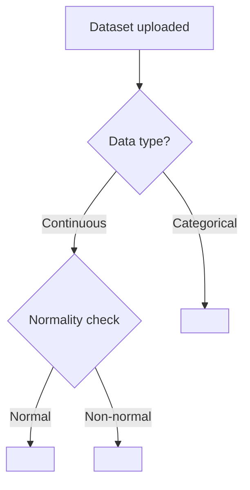
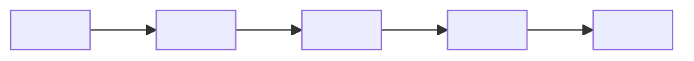

<!-- type: reference -->
# vX.Y.Z — [Feature Name]: Release Plan

<!-- TEMPLATE: Replace "vX.Y.Z" with the target version and "[Feature Name]" with a short noun-phrase label for the headline capability (e.g. "Assumption Validation Hardening"). The title must match the branch name and the CHANGELOG entry. -->

**Plan type:** Actionable release plan — <!-- TEMPLATE: one-line characterisation of the release, e.g. "statistical-core correctness hardening for comparison agents" -->
**Audience:** Maintainer, reviewer, statistician reviewer, Jr. developer
**Target release:** `X.Y.Z` — <!-- TEMPLATE: state the chain position, e.g. "ships first in the Part 2 hardening chain" or "standalone release" -->
**Current released version:** `<!-- TEMPLATE: current version from pyproject.toml -->`
**Branch:** `feat/<!-- TEMPLATE: kebab-case feature slug -->`
**Status:** Draft
**Last reviewed:** <!-- TEMPLATE: ISO date, e.g. 2026-05-01 -->

> [!IMPORTANT]
> **Scope (binding).** This release ships <!-- TEMPLATE: enumerate the exact surfaces shipped, e.g. "updated normality agent logic, new assumption log migration, updated test fixtures" -->.
> It does **not** ship <!-- TEMPLATE: enumerate explicit exclusions, e.g. "frontend UI changes, new API routes, new statistical tests" -->.
> Roadmap reference: [ROADMAP.md](ROADMAP.md).
> <!-- TEMPLATE: If an earlier draft exists that is superseded, note its archive path here. -->

> [!NOTE]
> **Cross-release ordering.** <!-- TEMPLATE: Explain the dependency chain. Which release or Part must ship before this one, and why? Which release ships after? If this is a standalone release, state that explicitly. -->

**Companion refs:**

<!-- TEMPLATE: List predecessor plan(s) first, then successor plan(s), then driver documents. Use relative paths from docs/plan/. -->
- [ROADMAP.md](ROADMAP.md) — authoritative roadmap and phase overview
- [vA.B.C — Predecessor Feature: Release Plan](implemented/vA_B_C_predecessor_plan.md) — shipped before
- [vX.Y.(Z+1) — Successor Feature: Release Plan](vX_Y_Zp1_successor_plan.md) — ships after

**Builds on:**

<!-- TEMPLATE: List every already-implemented surface, agent, service, or migration this release consumes. Be concrete: module paths and symbol names. Avoid vague "existing machinery" references. -->
- `<!-- symbol name -->` from `statmate/<!-- path -->`
- `<!-- symbol name -->` from `database/<!-- path -->`

---

## 1. Why this plan exists

<!-- TEMPLATE: Explain what gap or problem the release closes, why it must be closed now rather than later, and what the researcher/user experience looks like before and after. Write in first-person-plural ("we", "the release"). Keep to 2–4 paragraphs. -->

> The release should let a researcher answer two crisp questions:
>
> 1. <!-- TEMPLATE: First crisp question the release answers, e.g. "Which statistical test is appropriate for my data and study design?" -->
> 2. <!-- TEMPLATE: Second crisp question the release answers, e.g. "Are the assumptions for that test satisfied, and what warnings apply?" -->

> [!IMPORTANT]
> <!-- TEMPLATE: State the single largest statistical or correctness risk: the misunderstanding or agent error that would most damage result validity if it slipped through. Every public result, docstring, and changelog entry in this release must preserve the distinction named here. -->

### Planning principles

<!-- TEMPLATE: Add 6–10 rows. Each row names one guiding principle and its concrete engineering implication. Keep each cell to one or two sentences. -->

| Principle                        | Implication                                                                                                                                                                                         |
| -------------------------------- | --------------------------------------------------------------------------------------------------------------------------------------------------------------------------------------------------- |
| Additive only                    | Existing API models, database columns, and Pydantic field shapes are preserved. No field rename or removal without a migration and version bump.                                                    |
| Agent determinism                | LLM agent prompts and structured outputs must produce consistent test selections and summaries for equivalent inputs; use temperature=0 and structured output where possible.                       |
| Assumption integrity             | Every statistical test recommendation must be gated by assumption validation; no test result is emitted without a corresponding assumption log entry.                                               |
| Regression visibility            | Every agent or statistical-core change must appear as an updated test fixture or snapshot, not a silent output flip.                                                                                |
| Statistical honesty              | Output fields distinguish test result from interpretation. P-values, effect sizes, and confidence intervals are emitted as structured fields, never only embedded in prose.                         |
| SOLID + Hexagonal                | All code follows SOLID (see Architecture section below). All new surfaces respect the hexagonal layer map: domain never imports adapters, routes are thin, ports live in `core/base_interfaces.py`. |
| <!-- TEMPLATE: add principle --> | <!-- TEMPLATE: add implication -->                                                                                                                                                                  |

### Architecture — Hexagonal (Ports & Adapters), mandatory

The project uses **Hexagonal Architecture** as the single, non-negotiable structural pattern. All contributors must understand the layer map before writing code:

```
┌─────────────────────────────────────────────────────────┐
│  Inbound adapters                                       │
│  statmate/api/routes/   frontend/src/   statmate/ui/    │
├─────────────────────────────────────────────────────────┤
│  Application services (orchestrate domain)              │
│  statmate/api/services/   statmate/workflow/            │
├─────────────────────────────────────────────────────────┤
│  Domain (pure, no I/O)                                  │
│  statmate/statistical_core/   statmate/agents/          │
│  Ports defined in: statmate/core/base_interfaces.py     │
├─────────────────────────────────────────────────────────┤
│  Outbound adapters                                      │
│  database/   statmate/api/scheduler/   LLM providers    │
└─────────────────────────────────────────────────────────┘
```

**Layer rules (violations block merge):**

- Domain (`statistical_core/`, `agents/`) **must not import** from `statmate/api/`, `database/`, or any I/O layer. Dependency direction is always inward.
- Application services import domain and outbound adapters; they **never** import from `statmate/api/routes/`.
- Ports (new protocols or ABCs) belong in `statmate/core/base_interfaces.py`. Concrete adapters implement those ports and live in the adapter layer.
- Routes are **thin**: they validate HTTP input, call one service method, and return a Pydantic response. No business logic, no direct DB access.
- Database schema changes require a migration SQL file in `database/migrations/` with a descriptive filename; no ORM model mutation without a matching migration.
- Frontend changes live exclusively under `frontend/src/`; no Python files are modified in a frontend-only release.
- LangGraph workflow changes (nodes, edges, state fields) must update `statmate/workflow/graph_metadata.py` and the corresponding `tests/test_workflow_graph_metadata.py` fixture.
- <!-- TEMPLATE: add release-specific layer rule -->

### SOLID — mandatory, with codebase enforcement points

Every code change in this release is reviewed against all five principles. Violations are reported as blocking concerns by `rubber_duck`.

| Principle                     | Enforcement rule                                                                                                                                                                                                                                                      | Codebase location                       |
| ----------------------------- | --------------------------------------------------------------------------------------------------------------------------------------------------------------------------------------------------------------------------------------------------------------------- | --------------------------------------- |
| **S** — Single Responsibility | Each module/class does one thing. Agents handle one statistical concern; services handle one workflow stage; routes handle one resource. Split when a class has more than one reason to change.                                                                       | All layers                              |
| **O** — Open/Closed           | New statistical tests are new modules in `statmate/statistical_core/`; new agents are new files in `statmate/agents/`. Existing modules are not modified to accommodate a new test type.                                                                              | `statistical_core/`, `agents/`          |
| **L** — Liskov Substitution   | All implementations of `StatisticalTest`, `DataTransformer`, and any ABC in `statmate/core/base_interfaces.py` must be substitutable for their base type without changing program correctness. Protocol implementations are covered by `mypy`/`ty` structural checks. | `core/base_interfaces.py`               |
| **I** — Interface Segregation | Protocols are small and role-specific (e.g. `StatisticalTest` is separate from `DataTransformer`). No agent or service is forced to implement methods it does not use. New ports are narrow by default.                                                               | `core/base_interfaces.py`               |
| **D** — Dependency Inversion  | Routes depend on service *abstractions* injected via FastAPI `Depends()`; services depend on port interfaces, not concrete DB or file-system classes. No `import SQLAlchemy` in domain modules.                                                                       | `statmate/api/dependencies.py`, `core/` |

> [!IMPORTANT]
> If a new class cannot be placed cleanly within the hexagonal layer map, or if it violates a SOLID principle, the correct response is to redesign — not to add an exception. Raise an open question in Section 5 before implementation begins.

### Architecture rules — release-specific invariants

<!-- TEMPLATE: List the non-negotiable engineering invariants specific to this release. These are checked by the reviewer before reading the implementation. Add or remove bullets to match the release. -->

- All new API models are **Pydantic models** defined in `statmate/api/models/`; no raw dicts cross route boundaries.
- New statistical methods belong in `statmate/statistical_core/`; new agents in `statmate/agents/`; new workflow nodes/edges in `statmate/workflow/`.
- New API routes are registered in `statmate/api/routes/` and wired into `statmate/api/main.py`; no new top-level FastAPI apps are introduced.
- <!-- TEMPLATE: add release-specific invariant (e.g. "No new database table is introduced in this release.") -->
- <!-- TEMPLATE: add release-specific invariant -->

### Feature inventory

<!-- TEMPLATE: Assign a short ID prefix (e.g. "AVH" for Assumption Validation Hardening, "RPT" for Reporting). Fill one row per deliverable. Add or remove rows as needed. Phase values: 0 = domain models/contracts, 1 = statistical core / agent logic, 2 = API routes/services, 3 = frontend/UI, 4 = tests/fixtures, 5 = CI/infra, 6 = docs/release. -->

| ID      | Feature                                            | Phase | Priority | Status      |
| ------- | -------------------------------------------------- | ----- | -------- | ----------- |
| XXX-F00 | <!-- TEMPLATE: Pydantic models or DB migration --> | 0     | P0       | Not started |
| XXX-F01 | <!-- TEMPLATE: Statistical core or agent logic --> | 1     | P0       | Not started |
| XXX-F02 | <!-- TEMPLATE: API route or service -->            | 2     | P1       | Not started |
| XXX-F03 | <!-- TEMPLATE: Frontend component or script -->    | 3     | P1       | Not started |
| XXX-F04 | <!-- TEMPLATE: Tests and fixtures -->              | 4     | P0       | Not started |

---

### Reviewer acceptance block

<!-- TEMPLATE: This block defines the release success criteria. A reviewer must be able to verify every item independently. Write 8 or more numbered items, each with a bold subheading and 2–3 bullet sub-points. Items should cover: models/contracts, agent/statistical-core logic, API surface, database, regression discipline, documentation, and release engineering. -->

`X.Y.Z` is successful only if all of the following are visible together:

1. **API models and contracts**
   - <!-- TEMPLATE: Name the Pydantic request/response models that must exist in statmate/api/models/. -->
   - <!-- TEMPLATE: Name any DB migration files in database/migrations/ and the columns they add or modify. -->
   - <!-- TEMPLATE: Confirm no existing API field is renamed or removed without a migration. -->

2. **Statistical core and agent logic**
   - <!-- TEMPLATE: Name the statistical method(s) added or updated in statmate/statistical_core/. -->
   - <!-- TEMPLATE: Name the agent(s) added or updated in statmate/agents/ and their prompt changes. -->
   - <!-- TEMPLATE: Confirm assumption validation is gated before any test result is emitted. -->

3. **Workflow integration**
   - <!-- TEMPLATE: Name any new or modified nodes/edges in statmate/workflow/. -->
   - <!-- TEMPLATE: Confirm statmate/workflow/graph_metadata.py is updated. -->
   - <!-- TEMPLATE: Confirm tests/test_workflow_graph_metadata.py fixture is updated and green. -->

4. **API routes and services**
   - <!-- TEMPLATE: Name the routes added or modified in statmate/api/routes/. -->
   - <!-- TEMPLATE: Name the services added or modified in statmate/api/services/. -->
   - <!-- TEMPLATE: Confirm all routes return documented Pydantic response models. -->

5. **Regression discipline**
   - <!-- TEMPLATE: Name the test files added or updated in tests/. -->
   - <!-- TEMPLATE: State what constitutes a fixture change vs a silent output flip. -->
   - <!-- TEMPLATE: Confirm uv run pytest passes with 0 failures before tagging. -->

6. **Frontend (if applicable)**
   - <!-- TEMPLATE: Name the components or pages added or modified under frontend/src/. -->
   - <!-- TEMPLATE: Confirm no Python source files are modified in a frontend-only release. -->
   - <!-- TEMPLATE: Confirm the React build (cd frontend && npm run build) passes cleanly. -->

7. **Documentation**
   - <!-- TEMPLATE: Name the primary docs page(s) created or updated under docs/. -->
   - <!-- TEMPLATE: Describe the README update required (badges, feature list, quickstart). -->
   - <!-- TEMPLATE: Describe the CHANGELOG entry framing. -->

8. **Release engineering**
   - <!-- TEMPLATE: Confirm version bump locations: pyproject.toml, statmate/__init__.py, CHANGELOG.md. -->
   - <!-- TEMPLATE: Confirm uv run pytest and uv run ruff check both pass clean. -->
   - <!-- TEMPLATE: Confirm the git tag is created on main after merge. -->

9. **SOLID and hexagonal compliance**
   - Domain modules (`statistical_core/`, `agents/`) have zero imports from `statmate/api/` or `database/`; verified by `uv run ruff check` import-boundary rules or manual grep.
   - Every new class or function can be assigned unambiguously to one hexagonal layer without cross-layer leakage.
   - `rubber_duck` returned "no material SOLID/hexagonal concerns" or all raised concerns have a named fix owner.

10. **<!-- TEMPLATE: add acceptance item subheading -->**
    - <!-- TEMPLATE: add sub-point -->
    - <!-- TEMPLATE: add sub-point -->

---

## 2. Statistical and agent design

> [!IMPORTANT]
> Every developer MUST read this section before writing any agent or statistical-core code.
> This release is <!-- TEMPLATE: describe the statistical or agent risk in one sentence, e.g. "small in surface area but high in statistical risk: a wrong assumption check will recommend an invalid test for non-normal small samples." -->

### 2.1. Notation

<!-- TEMPLATE: Define all statistical notation used in this release. Use KaTeX inline ($...$) and block ($$...$$) notation. Name each quantity and its codebase mapping. For example:

- $p$ — p-value from the selected statistical test; maps to `AnalysisResult.p_value`
- $\alpha$ — significance threshold (default 0.05); maps to `config/settings.py:SIGNIFICANCE_LEVEL`
- $n$ — sample size per group; used in assumption checks in `statmate/statistical_core/base.py`

Remove this comment when the section is filled. -->

### 2.2. Test selection logic

<!-- TEMPLATE: Describe the decision logic that determines which statistical test is selected. Use a Mermaid flowchart (≤ 15 nodes) showing the decision path from data characteristics to test selection. Reference the relevant agent(s) and statistical_core module(s) by name. -->



### 2.3. Assumption validation invariants

<!-- TEMPLATE: List the hard statistical invariants that the implementation must enforce. Translate each invariant into its codebase enforcement point (agent prompt constraint, statistical_core assertion, or test). For example:

> [!IMPORTANT]
> Invariant A — normality check before parametric test:
> Shapiro-Wilk must be run and its result recorded in the assumption log before any t-test or ANOVA result is emitted.
> Enforced by: `statmate/agents/normality_agent.py` and `database/migrations/add_assumption_log.sql`.

Remove this comment when the section is filled. -->

---

## 3. Phased delivery

### Phase 0 — Models and contracts

<!-- TEMPLATE: Describe the Pydantic models and database migrations that must land first. This phase has no agent or statistical-core logic; it only defines types and schema. -->

**Scope.** Land the Pydantic request/response models, any database migration(s), and confirm all imports resolve.

**Acceptance criteria:**

- <!-- TEMPLATE: Pydantic models exist in statmate/api/models/ with documented fields. -->
- <!-- TEMPLATE: Migration SQL file exists in database/migrations/ and applies cleanly. -->
- <!-- TEMPLATE: uv run python -c "from statmate.api.models import ..." succeeds. -->
- <!-- TEMPLATE: No existing field or column is renamed or removed without an explicit migration. -->

### Phase 1 — Statistical core and agent logic

<!-- TEMPLATE: Describe the statistical method(s) and agent changes. Include a Mermaid flowchart showing the data flow through the LangGraph workflow. Keep the diagram to ≤ 15 nodes. -->



**Acceptance criteria:**

- <!-- TEMPLATE: Statistical method exists in statmate/statistical_core/ with documented inputs and outputs. -->
- <!-- TEMPLATE: Agent prompt includes explicit assumption-validation gate. -->
- <!-- TEMPLATE: Unit tests cover the happy path, failed-assumption path, and edge cases. -->
- <!-- TEMPLATE: graph_metadata.py updated if any workflow node or edge changes. -->

### Phase 2 — API routes and services

<!-- TEMPLATE: Describe the FastAPI routes and service layer changes. If no new routes are introduced, replace this section with a note and remove it from the feature inventory. -->

**Acceptance criteria:**

- <!-- TEMPLATE: Route exists in statmate/api/routes/ and returns the documented Pydantic model. -->
- <!-- TEMPLATE: Service in statmate/api/services/ encapsulates business logic; no raw SQL in routes. -->
- <!-- TEMPLATE: OpenAPI schema (GET /docs) reflects the new or updated endpoint. -->

### Phase 3 — Frontend

<!-- TEMPLATE: Describe the React frontend changes. If no frontend changes are introduced, replace this section with a note and remove it from the feature inventory. Reference the relevant components under frontend/src/. -->

**Acceptance criteria:**

- <!-- TEMPLATE: Component exists in frontend/src/ and renders the new data correctly. -->
- <!-- TEMPLATE: cd frontend && npm run build passes with 0 errors. -->
- <!-- TEMPLATE: No Python source files are modified in this phase. -->

---

## 4. Out of scope

<!-- TEMPLATE: List things that are explicitly not in this release and the reason. Be specific enough that a reviewer can confirm none of these slipped in. -->

- <!-- TEMPLATE: e.g. "New statistical test types (e.g. survival analysis) — belong in a later Part 2 release." -->
- <!-- TEMPLATE: e.g. "Frontend redesign — UI changes are deferred to the frontend-decomposition milestone." -->
- <!-- TEMPLATE: e.g. "New LLM provider integrations — model config changes are handled separately." -->
- <!-- TEMPLATE: add exclusion -->

---

## 5. Open questions

<!-- TEMPLATE: Number each open question. Remove entries when resolved. Keep this list current throughout implementation; a non-empty list at release time is a blocker. -->
<!-- TEMPLATE: remove when resolved -->

1. <!-- TEMPLATE: e.g. "Should the normality agent rerun Shapiro-Wilk or use a cached result from a prior analysis? Decision needed before Phase 1 begins." -->
2. <!-- TEMPLATE: e.g. "What is the correct fallback behaviour when sample size is too small for the selected test?" -->
3. <!-- TEMPLATE: e.g. "Does the assumption log need to store raw test statistics or only the pass/fail decision?" -->
