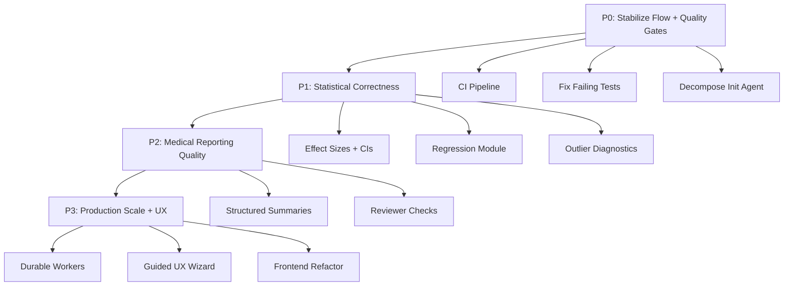
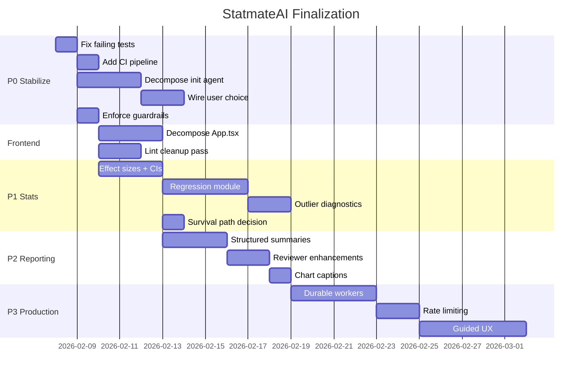

# StatmateAI — Product Finalization Roadmap

Date: 2026-02-08
Status: Draft for review

## 1. Current State Assessment

### What is done (checked off in TODO.md)
- Streaming + decision visibility (P0 complete)
- Analysis history, comments, column rename, provider keys (P0 complete)
- Assumption diagnostics, reviewer/consensus agent, checkpointing (P0 complete)
- Hierarchical results + progress, exports, rate limiting, quotas, PII masking (P0 complete)
- Workflow graph visualization (P0 complete)
- Statistical design classification — paired vs. independent (P0 complete)
- Data viz auto-generation, export/docs, release prep items (P2 complete)

### What remains (from audit and TODO.md open items)

**Immediate risks:**
- 2 failing tests (design verification contract drift)
- 550 ruff lint findings
- No CI pipeline
- Monolithic `App.tsx` at ~1940 LOC
- Monolithic `initial_insights_agent.py` at ~598 LOC
- Only 6 test files with limited coverage

**Feature gaps:**
- No regression module (linear, multiple, logistic)
- Effect sizes and CIs inconsistent across test families
- No user-in-the-loop choice wiring
- No durable worker queue (still BackgroundTasks)
- Scheduled task parsing is placeholder
- No API rate-limiting middleware
- Frontend guided workflow UX not started

---

## 2. Priority Phases

---

## 3. P0 — Stabilize Flow and Quality Gates

### P0-1: Fix 2 failing tests
- **Files:** `tests/test_validation_design.py`, `tests/test_workflow_logic.py`
- **Root cause:** Design reconciliation behavior changed but test expectations did not follow. Rationale text assertions are brittle exact-match.
- **Contract decision:** Mismatch should set `design_verification.mismatch=True` and route to `DESIGN_RECONCILIATION` (current production behavior — Option B).
- **Action:** Update test assertions to match reconciliation routing. Replace exact-phrase rationale checks with semantic checks (e.g., contains `wide-format` AND `pair`).

### P0-2: Decompose initialization agent
- **Files:** `statmate/agents/initial_insights_agent.py`, `statmate/workflow/nodes.py`
- **Problem:** ~598 LOC monolithic prompt mixing schema understanding, route inference, transformation decisioning, metadata generation.
- **Action:** Split into 3 sub-phases:
  1. Structural/schema pre-check (deterministic)
  2. Column/role proposal (agent-assisted, smaller prompt)
  3. Route proposal (deterministic engine + agent hints)
- Add unit tests per sub-phase in `tests/test_initialization_pipeline.py`.

### P0-3: Wire user-in-the-loop choice
- **Files:** `statmate/api/routes/analysis.py`, `statmate/workflow/nodes.py` (Choice Node), `frontend/src/App.tsx`
- **Problem:** `user_selected_option` field exists but has no API route or frontend control.
- **Action:** Add API field for route override, frontend control to submit, workflow consumption in Choice Node.

### P0-4: Enforce or remove assumption guardrails
- **Files:** `statmate/core/validation.py`, `statmate/statistical_core/*.py`
- **Problem:** `requires_assumptions` decorator exists but is not applied to production functions.
- **Action:** Either apply to all statistical entrypoints or remove the dead abstraction.

### P0-5: Add CI workflow
- **Files:** New `.github/workflows/ci.yml`
- **Action:** `pytest` + targeted `ruff` policy (at minimum changed-files gate).

---

## 4. P1 — Statistical Correctness

### P1-1: Standardize result schema
- Create `statmate/statistical_core/effect_size.py` with shared helpers.
- Update `comparison.py`, `anova.py`, `categorical_comparison.py`, `linear_correlation.py` to emit consistent `effect_size_type`, `confidence_interval`.

### P1-2: Power interpretation
- Add post-hoc power for non-significant results where sample size allows.

### P1-3: Regression module
- New `statmate/statistical_core/regression.py`: linear, multiple (with VIF), logistic.
- Wire into workflow graph as new branch from route engine.

### P1-4: Outlier/influence diagnostics
- Cook's distance, leverage, robust outlier summary in blueprint/assumption log.

### P1-5: Survival placeholder
- Implement or explicitly disable the `cox_regression` route.

---

## 5. P2 — Medical Reporting Quality

### P2-1: Structured summaries
- Summarizer output: `finding`, `evidence`, `caveat` fields + composed `summary` for backward compat.
- Enforce CONSORT/STROBE alignment in prompt contract.

### P2-2: CI + effect-size policy
- Post-summary validator: if CI/effect-size exists in inputs, summary must include it.
- Missing metrics explained explicitly, not silently omitted.

### P2-3: Clinical significance judgment
- Explicit threshold/rationale hooks beyond p < 0.05.

### P2-4: P-hacking / multiple-comparison checks
- Reviewer detects and flags multiple comparison issues.

### P2-5: Chart narrative captions
- Non-statistician-friendly captions for auto-generated plots.

---

## 6. P3 — Production Scale, Security, UX

### P3-1: Durable workers
- Celery + Redis (or Temporal). API enqueues, worker executes.
- SSE status reads from DB; progress from persisted `decision_steps`.

### P3-2: Real scheduler
- Parse cron expressions. Compute and persist `next_run`.

### P3-3: API rate-limiting
- Middleware-based rate limiting for abuse control.

### P3-4: PII modes
- Mask-only, drop-sensitive, audit report modes.

### P3-5: Data lifecycle
- Retention/TTL/deletion policy per org/project.

### P3-6: Guided UX
- Research-question wizard, assumption stoplights, spreadsheet column casting.

### P3-7: UI strategy
- Decide React vs Streamlit as primary; consolidate to avoid dual divergence.

---

## 7. Cross-cutting Technical Debt

### Frontend refactor
- **File:** `frontend/src/App.tsx` (~1940 LOC)
- Decompose into focused components: `DataUpload`, `AnalysisRunner`, `ResultsViewer`, `WorkflowGraph`, `VersionHistory`, `CredentialsPanel`.
- Add Playwright e2e tests using the new MCP.

### Lint baseline
- Current: ~550 ruff findings.
- Target: establish a clean baseline, gate PRs against regressions.

### Test coverage
- Current: 6 test files, ~36 passing.
- Target: >80% coverage on core paths (statistical core, workflow routing, API services).

### Documentation
- Update screenshots and user-facing docs to match current UI state.

---

## 8. Recommended Execution Order

---

## 9. What to Do First

1. **Fix the 2 failing tests** — unblocks everything else and establishes green baseline.
2. **Add CI pipeline** — prevents future regressions.
3. **Decompose init agent** — highest-risk bottleneck in agent flow.
4. **Standardize effect sizes + CIs** — core statistical completeness.
5. **Decompose App.tsx** — enables safe frontend iteration.

Would you like to proceed with P0-1 (fixing the failing tests) first, or adjust this plan?
