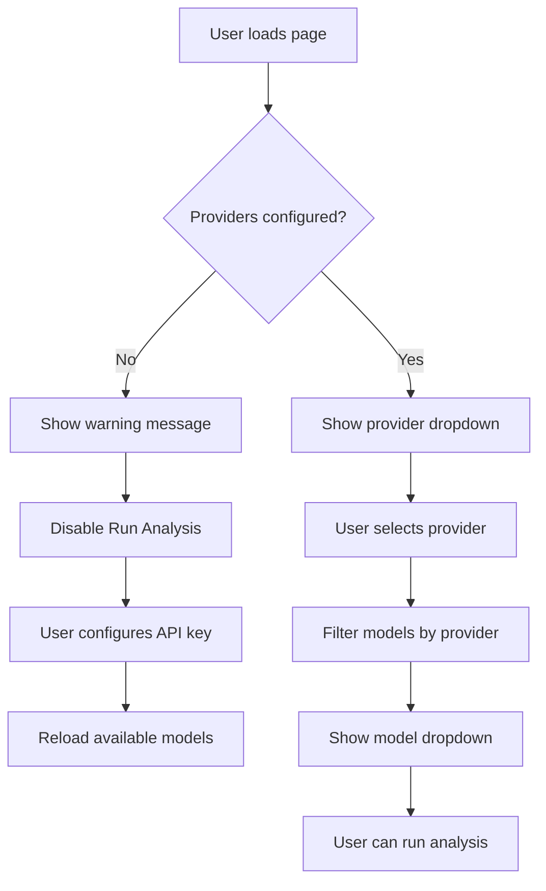

# Model Settings UI Fix Plan

## Problem Statement

The model settings UI has two main issues:

1. **Provider dropdown shows unconfigured providers** - Users can select providers like "groq" even when they haven't configured API keys for them.

2. **Model dropdown shows irrelevant models** - When selecting a provider, the model dropdown shows all models for that provider regardless of whether the provider is configured.

## Current Implementation Analysis

### Frontend (App.tsx)

**Provider Options (lines 819-824):**
```typescript
const providerOptions = useMemo(() => {
  const fromModels = availableModels.map((m) => m.provider);
  const merged = Array.from(new Set([...fromModels, ...configuredProviders]));
  if (merged.length) return merged;
  return ['openai', 'anthropic', 'google', 'groq', 'ollama'];
}, [availableModels, configuredProviders]);
```

**Model Options (lines 826-829):**
```typescript
const modelOptions = useMemo(() => {
  if (!provider) return [];
  return availableModels.filter((m) => m.provider === provider);
}, [availableModels, provider]);
```

**API Call (line 269):**
```typescript
const res = await api.availableModels(true);  // include_all=true returns ALL models
```

### Backend (models.py)

The `/models/available` endpoint:
- `include_all=true` → Returns ALL supported models
- `include_all=false` → Returns only models from configured providers

## Proposed Changes

### Change 1: Filter Provider Options to Configured Only

**File:** `frontend/src/App.tsx`

**Current:**
```typescript
const providerOptions = useMemo(() => {
  const fromModels = availableModels.map((m) => m.provider);
  const merged = Array.from(new Set([...fromModels, ...configuredProviders]));
  if (merged.length) return merged;
  return ['openai', 'anthropic', 'google', 'groq', 'ollama'];
}, [availableModels, configuredProviders]);
```

**Proposed:**
```typescript
// Only show providers that are actually configured
const providerOptions = useMemo(() => {
  if (configuredProviders.length) {
    return configuredProviders;
  }
  // Fallback to default list only if no providers are configured
  return ['openai', 'anthropic', 'google', 'groq', 'ollama'];
}, [configuredProviders]);
```

### Change 2: Fetch Only Configured Models by Default

**File:** `frontend/src/App.tsx`

**Current (line 269):**
```typescript
const res = await api.availableModels(true);
```

**Proposed:**
```typescript
// Fetch only configured models by default
const res = await api.availableModels(false);
```

This ensures `availableModels` only contains models from configured providers.

### Change 3: Add Visual Feedback for Provider Configuration Status

**File:** `frontend/src/App.tsx`

Update the provider dropdown to show configuration status:

```tsx
<div className="flex items-center gap-2 rounded-full border border-slate-800/50 px-3 py-1 text-xs text-slate-400">
  <Settings size={14} />
  <select
    value={provider}
    onChange={(e) => setProvider(e.target.value)}
    className="bg-transparent text-sm outline-none"
  >
    {providerOptions.map((p) => (
      <option key={p} value={p}>
        {p.charAt(0).toUpperCase() + p.slice(1)}
      </option>
    ))}
  </select>
  {configuredProviders.length === 0 && (
    <span className="text-amber-400 text-[10px]">Configure API keys below</span>
  )}
</div>
```

### Change 4: Add Helper Text When No Providers Configured

Add a warning message near the model selector when no providers are configured:

```tsx
{configuredProviders.length === 0 && (
  <div className="rounded-xl border border-amber-500/30 bg-amber-500/10 p-3 text-sm text-amber-200">
    <p className="font-semibold">No API keys configured</p>
    <p className="text-xs mt-1">
      Configure your API keys in the "Provider credentials" section below to enable model selection.
    </p>
  </div>
)}
```

### Change 5: Disable Run Analysis Button When No Provider Configured

**File:** `frontend/src/App.tsx`

Update the run analysis button to be disabled when no providers are configured:

```tsx
<button
  onClick={() => handleRunAnalysis(false)}
  disabled={configuredProviders.length === 0}
  className="flex items-center gap-2 rounded-full bg-gradient-to-r from-cyan-400 to-blue-600 px-4 py-2 text-sm font-semibold text-slate-950 shadow-lg shadow-cyan-500/20 disabled:opacity-50 disabled:cursor-not-allowed"
>
  <Zap size={16} /> Run new version
</button>
```

## Implementation Order

1. **Update `loadModelMeta` function** - Change `include_all` to `false`
2. **Update `providerOptions` memo** - Filter to configured providers only
3. **Add visual feedback** - Warning messages and disabled states
4. **Test the changes** - Verify provider/model selection works correctly

## Files to Modify

| File                   | Changes                                                    |
| ---------------------- | ---------------------------------------------------------- |
| `frontend/src/App.tsx` | Update provider/model filtering logic, add visual feedback |

## Testing Checklist

- [ ] Provider dropdown only shows configured providers
- [ ] Model dropdown only shows models for selected provider
- [ ] Warning shown when no providers configured
- [ ] Run analysis disabled when no providers configured
- [ ] After configuring API keys, providers appear in dropdown
- [ ] After configuring API keys, models appear for that provider

## Diagram: Flow of Provider/Model Selection



## Notes

- The backend already supports filtering via `include_all` parameter
- The `configuredProviders` state is already populated from the API
- This is primarily a frontend fix with no backend changes required
