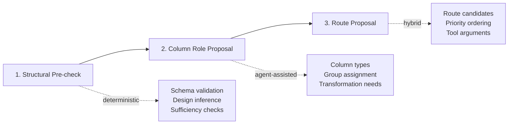

# P0 Stabilization - Execution Plan

**Date**: 2026-02-15  
**Priority**: P0 (Critical - Immediate)  
**Status**: Planning Phase

## Executive Summary

This plan addresses the 3 remaining P0 stabilization tasks from [`TODO.md`](../TODO.md):

1. **P0-2**: Split initialization agent into 3 phases (High complexity, High impact)
2. **P0-3**: Wire user-in-the-loop choice (Medium complexity, High impact)
3. **P0-4**: Apply or remove assumption guardrails (Low complexity, Medium impact)

**Recommended execution order**: P0-4 → P0-3 → P0-2

This order allows us to:
- Start with the simplest task to build momentum
- Implement user choice wiring before restructuring the initialization agent
- Tackle the most complex refactor last when we have better context

---

## Current State Analysis

### System Overview
- **Tests**: 38/38 passing (2 failing tests already fixed per TODO.md)
- **CI**: GitHub Actions workflow added (per TODO.md)
- **Complexity hotspots**:
  - [`statmate/agents/initial_insights_agent.py`](../statmate/agents/initial_insights_agent.py): ~598 LOC
  - [`statmate/workflow/nodes.py`](../statmate/workflow/nodes.py): ~1201 LOC

### Existing Infrastructure
- `user_selected_option` field exists in [`WorkflowState`](../statmate/workflow/state.py:84)
- `pending_routing_decision` dict used throughout workflow
- `Choice Node` exists and references user selection
- `requires_assumptions` decorator exists but is unused

---

## Task 1: P0-4 - Resolve Assumption Guardrails

**Complexity**: Low  
**Estimated effort**: 2-4 hours  
**Dependencies**: None

### Current State
- Decorator defined in [`statmate/core/validation.py:395`](../statmate/core/validation.py:395)
- No usage found in statistical core modules
- Creates maintenance burden and confusion

### Decision: Remove Dead Abstraction

**Rationale**:
- Workflow-level assumption handling already exists via [`validate_assumptions()`](../statmate/core/validation.py)
- Assumption diagnostics logged in [`build_data_blueprint()`](../statmate/workflow/blueprint.py)
- Function-level decorator adds complexity without clear benefit
- Current routing handles assumption violations via `DecisionEngine`

### Implementation Steps

#### 1.1. Remove decorator definition
**File**: [`statmate/core/validation.py`](../statmate/core/validation.py:395)

```python
# Remove lines ~395-420:
def requires_assumptions(normality: bool = False, variance: bool = False):
    """Decorator to guard statistical functions behind assumption checks."""
    # ... entire decorator implementation
```

#### 1.2. Verify no imports reference it
**Files to check**:
- [`statmate/statistical_core/comparison.py`](../statmate/statistical_core/comparison.py)
- [`statmate/statistical_core/anova.py`](../statmate/statistical_core/anova.py)
- [`statmate/statistical_core/categorical_comparison.py`](../statmate/statistical_core/categorical_comparison.py)

Search for: `requires_assumptions`

#### 1.3. Update documentation
**File**: [`docs/ARCHITECTURE_PROPOSAL.md`](../docs/ARCHITECTURE_PROPOSAL.md) or [`docs/WORKFLOW.md`](../docs/WORKFLOW.md)

Document that assumption validation is handled at:
- Workflow routing level (DecisionEngine)
- Blueprint construction phase
- Not at individual statistical function level

### Testing Strategy
- Run full test suite: `uv run python -m pytest -q`
- No behavioral changes expected
- Verify imports still resolve

### Acceptance Criteria
- [ ] Decorator removed from [`validation.py`](../statmate/core/validation.py)
- [ ] No import errors
- [ ] All 38 tests still pass
- [ ] Documentation updated

---

## Task 2: P0-3 - Wire User-in-the-Loop Choice

**Complexity**: Medium  
**Estimated effort**: 1-2 days  
**Dependencies**: P0-4 complete (optional)

### Current State

**Infrastructure exists**:
- [`WorkflowState.user_selected_option`](../statmate/workflow/state.py:84) field defined
- [`choice_node()`](../statmate/workflow/nodes.py:1280) checks `user_selected_option`
- [`resolve_choice()`](../statmate/workflow/nodes.py:1302) uses `pending_routing_decision`
- Frontend has no controls to set this value

**Missing pieces**:
- API route to accept route override
- Frontend UI to present options and submit choice
- Validation of override against allowed candidates

### Implementation Plan

#### 2.1. Backend: Extend Analysis Request Model

**File**: [`statmate/api/models/analysis.py`](../statmate/api/models/analysis.py)

Add optional field to `AnalysisCreate`:

```python
class AnalysisCreate(BaseModel):
    dataset_id: int
    configuration: AnalysisConfiguration
    route_override: str | None = Field(
        default=None,
        description="Optional user override for routing choice (must match NodeName enum)"
    )
```

#### 2.2. Backend: Persist Override in Service

**File**: [`statmate/api/services/analysis_service.py`](../statmate/api/services/analysis_service.py)

In `run_analysis()` method, set state before workflow execution:

```python
async def run_analysis(self, analysis_id: int, route_override: str | None = None):
    # ... existing setup ...
    
    # Initialize state with user override if provided
    initial_state = WorkflowState(
        df=df,
        user_selected_option=route_override,
        # ... other fields
    )
```

#### 2.3. Backend: Add Route Override Endpoint (Optional)

**File**: [`statmate/api/routes/analysis.py`](../statmate/api/routes/analysis.py)

For in-flight choice updates:

```python
class RouteOverrideRequest(BaseModel):
    selected_node: str

@router.post('/{analysis_id}/choice', response_model=schemas.AnalysisResponse)
async def set_route_choice(
    analysis_id: int,
    request: RouteOverrideRequest,
    service: AnalysisService = Depends(get_analysis_service),
    current_user: User = Depends(get_current_user),
):
    """Set user choice for routing decision."""
    # Validate node name against NodeName enum
    # Update analysis state
    # Return updated analysis
```

#### 2.4. Backend: Validate Override

**File**: [`statmate/workflow/nodes.py`](../statmate/workflow/nodes.py) or validation utility

Add validation in `choice_node()`:

```python
def choice_node(state: WorkflowState) -> WorkflowState:
    decision = state.pending_routing_decision or {}
    alternatives = decision.get('alternatives', [])
    primary = decision.get('primary')
    
    # Validate user override if present
    if state.user_selected_option:
        valid_options = [primary] + alternatives
        if state.user_selected_option not in valid_options:
            logger.warning(
                f"Invalid override '{state.user_selected_option}', "
                f"valid options: {valid_options}"
            )
            state.user_selected_option = None  # Fallback to default
    
    selected = state.user_selected_option or primary
    # ... rest of logic
```

#### 2.5. Frontend: API Client Extension

**File**: [`frontend/src/api/client.ts`](../frontend/src/api/client.ts)

Add method:

```typescript
export async function setRouteChoice(
  analysisId: number,
  selectedNode: string
): Promise<Analysis> {
  const response = await fetch(
    `${API_BASE_URL}/analysis/${analysisId}/choice`,
    {
      method: 'POST',
      headers: {
        'Content-Type': 'application/json',
        Authorization: `Bearer ${getToken()}`,
      },
      body: JSON.stringify({ selected_node: selectedNode }),
    }
  );
  if (!response.ok) throw new Error('Failed to set route choice');
  return response.json();
}
```

#### 2.6. Frontend: UI Component

**File**: [`frontend/src/App.tsx`](../frontend/src/App.tsx)

Add choice presentation component when `pending_routing_decision` exists:

```tsx
{analysis.pending_routing_decision && (
  <div className="bg-blue-50 border border-blue-200 rounded-lg p-4 mb-4">
    <h3 className="font-semibold mb-2">Routing Choice Required</h3>
    <p className="text-sm mb-3">
      Primary: {analysis.pending_routing_decision.primary}
    </p>
    {analysis.pending_routing_decision.alternatives?.length > 0 && (
      <div>
        <p className="text-sm font-medium mb-2">Alternatives:</p>
        <div className="space-y-2">
          {analysis.pending_routing_decision.alternatives.map((alt) => (
            <button
              key={alt}
              onClick={() => handleRouteChoice(alt)}
              className="block w-full text-left px-3 py-2 bg-white border rounded hover:bg-blue-50"
            >
              {alt}
            </button>
          ))}
        </div>
      </div>
    )}
  </div>
)}
```

### Testing Strategy

**Unit Tests**:
- Add `tests/test_route_override.py`
- Test valid/invalid override handling
- Test choice node with user selection

**Integration Tests**:
- API route tests with override payload
- Workflow execution with preset override

**Manual Tests**:
1. Upload dataset that triggers choice
2. Verify options displayed in UI
3. Select alternative route
4. Verify workflow follows selected path
5. Check `decision_steps` includes choice log

### Acceptance Criteria
- [ ] `route_override` field in API models
- [ ] Override persisted to `WorkflowState.user_selected_option`
- [ ] Invalid overrides rejected with 400 error
- [ ] Frontend displays choice options from `pending_routing_decision`
- [ ] User selection triggers workflow re-routing
- [ ] Choice logged in `state.choice_log`
- [ ] Tests cover valid/invalid scenarios

---

## Task 3: P0-2 - Split Initialization Agent

**Complexity**: High  
**Estimated effort**: 3-5 days  
**Dependencies**: P0-3 complete (recommended)

### Problem Statement

[`statmate/agents/initial_insights_agent.py`](../statmate/agents/initial_insights_agent.py) is overloaded:
- ~598 LOC
- Mixes schema understanding, route inference, transformation logic, metadata generation
- Large monolithic prompt (lines 13-30)
- Hard to test individual responsibilities

### Proposed Architecture

Split into **3 sequential sub-phases**:



### Implementation Plan

#### 3.1. Phase 1 - Structural Pre-check (Deterministic)

**New file**: [`statmate/workflow/initialization/structural_check.py`](../statmate/workflow/initialization/structural_check.py)

Create pure functions:

```python
@dataclass
class StructuralCheckResult:
    is_valid: bool
    row_count: int
    column_count: int
    column_types: dict[str, str]  # {col_name: 'numeric'|'categorical'|'datetime'}
    cardinality: dict[str, int]
    has_sufficient_samples: bool
    wide_format_detected: bool
    design_hint: StatisticalDesign | None
    errors: list[str]

def check_structural_validity(df: pd.DataFrame) -> StructuralCheckResult:
    """Phase 1: Deterministic schema and design pre-check."""
    # Use existing: get_structural_summary(), detect_wide_format_pairing()
    # Validate: row count, column count, types, missing data
    # Infer: initial design hint (paired/independent/mixed)
    ...
```

#### 3.2. Phase 2 - Column Role Proposal (Agent-assisted)

**New file**: [`statmate/workflow/initialization/column_role_agent.py`](../statmate/workflow/initialization/column_role_agent.py)

Create focused agent with smaller prompt:

```python
COLUMN_ROLE_PROMPT = """
You are a column role assignment assistant.

Given:
- Structural summary (types, cardinality)
- Design hint (paired/independent)

Tasks:
1. Identify analysis_columns (numeric variables for testing)
2. Identify group_column (categorical grouping variable)
3. Determine if transformation needed (wide→long, contingency table)
4. Specify tool_arguments for transformation

Rules:
- group_column must not be in analysis_columns
- For paired design, look for repeated measures structure
- For categorical analysis, identify row/column categories

Output: ColumnRoleResult matching schema.
"""

@dataclass
class ColumnRoleResult:
    analysis_columns: list[str]
    group_column: str | None
    data_transformation: str | None
    tool_arguments: dict[str, Any]
    confidence: float
```

#### 3.3. Phase 3 - Route Proposal (Hybrid)

**New file**: [`statmate/workflow/initialization/route_proposal.py`](../statmate/workflow/initialization/route_proposal.py)

Combine deterministic rules + agent hints:

```python
def propose_route(
    structural: StructuralCheckResult,
    roles: ColumnRoleResult,
    blueprint: DataBlueprint | None
) -> RouteProposal:
    """Phase 3: Determine route candidates with priority ordering."""
    
    # Deterministic constraints from DecisionEngine
    candidates = decision_engine.get_candidate_routes(
        design=structural.design_hint,
        data_type=infer_data_type(roles.analysis_columns),
        num_groups=get_group_count(roles.group_column)
    )
    
    # Agent provides ordering/confidence hints (optional)
    # Return ordered list with primary + alternatives
    ...
```

#### 3.4. Orchestration Layer

**Modified file**: [`statmate/workflow/nodes.py`](../statmate/workflow/nodes.py)

Refactor `call_initialization_agent()` to orchestrate sub-phases:

```python
async def call_initialization_agent(state: WorkflowState) -> WorkflowState:
    """Orchestrate 3-phase initialization pipeline."""
    df = state.df
    
    # Phase 1: Structural pre-check (deterministic)
    structural = check_structural_validity(df)
    if not structural.is_valid:
        return state.with_error(structural.errors)
    
    state.add_step(
        step=NodeName.INITIALIZATION,
        detail="Phase 1: Structural validation complete",
        data={"phase": "structural", "result": asdict(structural)}
    )
    
    # Phase 2: Column role assignment (agent-assisted)
    roles = await propose_column_roles(df, structural)
    
    state.add_step(
        step=NodeName.INITIALIZATION,
        detail="Phase 2: Column roles assigned",
        data={"phase": "roles", "result": asdict(roles)}
    )
    
    # Phase 3: Route proposal (hybrid)
    blueprint = build_data_blueprint(df, state)
    route = propose_route(structural, roles, blueprint)
    
    state.add_step(
        step=NodeName.INITIALIZATION,
        detail=f"Phase 3: Route proposed - {route.primary}",
        data={"phase": "route", "result": asdict(route)}
    )
    
    # Assemble final result (backward compatibility)
    result = InitialInsightsAgentResults(
        analysis_columns=roles.analysis_columns,
        group_column=roles.group_column,
        data_transformation=roles.data_transformation,
        tool_arguments=roles.tool_arguments,
        route_to_test=route.ordered_nodes,
        # ... other fields
    )
    
    # Execute transformation if needed
    if roles.data_transformation:
        state = execute_transformation(state, result)
    
    return state.with_initialization(result)
```

#### 3.5. Migration Strategy

**Step 1**: Create new modules alongside existing code  
**Step 2**: Add feature flag to toggle between old/new implementation  
**Step 3**: Run both in parallel, compare outputs  
**Step 4**: Switch default to new implementation  
**Step 5**: Remove old code after validation period

```python
# Feature flag in config/settings.py
USE_PHASED_INITIALIZATION = os.getenv('USE_PHASED_INIT', 'true').lower() == 'true'
```

### Testing Strategy

**New test file**: `tests/test_initialization_pipeline.py`

```python
def test_phase1_structural_check():
    """Test deterministic structural validation."""
    df = pd.DataFrame(...)
    result = check_structural_validity(df)
    assert result.is_valid
    assert result.design_hint == StatisticalDesign.INDEPENDENT

def test_phase2_column_roles_independent():
    """Test agent-assisted column role assignment for independent design."""
    ...

def test_phase2_column_roles_paired():
    """Test column role assignment for paired/wide-format data."""
    ...

def test_phase3_route_proposal():
    """Test hybrid route proposal logic."""
    ...

def test_full_pipeline_integration():
    """Test complete 3-phase pipeline."""
    ...

def test_backward_compatibility():
    """Verify new implementation produces same results as old."""
    ...
```

**Regression tests**:
- Run existing [`test_workflow_logic.py`](../tests/test_workflow_logic.py) against new implementation
- Verify no behavioral changes for established datasets

**Manual validation**:
1. Upload 5 representative datasets (paired, independent, categorical, wide-format, long-format)
2. Compare old vs new initialization outputs
3. Verify route correctness and `decision_steps` clarity

### Acceptance Criteria
- [ ] New modules created in `statmate/workflow/initialization/`
- [ ] Phase 1 (structural check) is fully deterministic
- [ ] Phase 2 (column roles) has focused prompt <200 lines
- [ ] Phase 3 (route proposal) separates rules from hints
- [ ] Orchestration function in [`nodes.py`](../statmate/workflow/nodes.py) delegates cleanly
- [ ] Unit tests for each phase pass
- [ ] Integration tests match old behavior
- [ ] Feature flag allows A/B comparison
- [ ] Documentation updated with new architecture

---

## Execution Strategy

### Phase 1: Quick Wins (P0-4)
**Duration**: 1 day  
**Risk**: Low

1. Remove `requires_assumptions` decorator
2. Update documentation
3. Run full test suite
4. Commit with message: `P0-4: Remove unused assumption guardrail decorator`

### Phase 2: User Choice Wiring (P0-3)
**Duration**: 2-3 days  
**Risk**: Medium

**Day 1**:
- Backend: Add `route_override` to API models
- Backend: Wire override to WorkflowState
- Backend: Add validation logic
- Unit tests for validation

**Day 2**:
- Backend: Add `/choice` endpoint (optional)
- Frontend: Extend API client
- Frontend: Add choice UI component
- Integration tests

**Day 3**:
- Manual testing across scenarios
- Bug fixes and refinement
- Documentation update
- Commit with message: `P0-3: Wire user-in-the-loop route choice end-to-end`

### Phase 3: Initialization Agent Split (P0-2)
**Duration**: 4-5 days  
**Risk**: High

**Day 1-2**:
- Create new module structure
- Implement Phase 1 (structural check)
- Implement Phase 2 (column roles) with new agent
- Unit tests for Phases 1-2

**Day 3**:
- Implement Phase 3 (route proposal)
- Create orchestration function
- Add feature flag
- Unit tests for Phase 3

**Day 4**:
- Integration testing with feature flag
- Parallel comparison old vs new
- Fix discrepancies

**Day 5**:
- Manual validation across datasets
- Performance testing
- Documentation update
- Switch default to new implementation
- Commit with message: `P0-2: Refactor initialization into 3-phase pipeline`

### Rollback Plan

Each task should be in its own Git branch:
- `p0-4-remove-guardrails`
- `p0-3-user-choice-wiring`
- `p0-2-init-agent-refactor`

If issues arise:
1. Revert the specific branch
2. Investigate root cause
3. Fix and re-test before re-merging

For P0-2 specifically, the feature flag allows instant rollback without code changes.

---

## Success Metrics

### P0-4 (Assumption Guardrails)
- [ ] Decorator code removed (~25 LOC)
- [ ] Zero import errors
- [ ] 38/38 tests pass
- [ ] Ruff warnings unchanged or reduced

### P0-3 (User Choice)
- [ ] `route_override` field functional
- [ ] Frontend UI displays choices
- [ ] User selection changes workflow path
- [ ] Invalid overrides return 400
- [ ] Choice logged in `state.choice_log`
- [ ] Manual test: Select alternative route and verify execution

### P0-2 (Init Agent Split)
- [ ] 3 separate, testable modules
- [ ] Prompt size reduced >50%
- [ ] New tests: >15 test cases covering each phase
- [ ] Backward compatibility verified
- [ ] Performance: initialization time unchanged or improved
- [ ] Manual test: 5 datasets produce correct routes

### Overall P0 Completion
- [ ] All 38+ tests passing
- [ ] CI pipeline green
- [ ] Ruff baseline maintained or improved
- [ ] No production regressions
- [ ] Documentation reflects new architecture
- [ ] Team can iterate faster on workflow changes

---

## Risk Assessment

| Risk | Probability | Impact | Mitigation |
|------|-------------|--------|------------|
| P0-2 refactor introduces regressions | Medium | High | Feature flag, parallel testing, extensive validation |
| User choice wiring breaks existing flows | Low | Medium | Validation layer, fallback to default behavior |
| Assumption guardrail removal has hidden dependencies | Low | Low | Thorough grep search, test coverage |
| Timeline slippage on P0-2 | Medium | Medium | Break into smaller increments, daily checkpoints |
| Frontend/Backend contract mismatch (P0-3) | Low | Medium | TypeScript types, API schema validation |

---

## Next Steps

1. **Review this plan** with team/stakeholders
2. **Get approval** for recommended execution order: P0-4 → P0-3 → P0-2
3. **Create Git branches** for each task
4. **Begin with P0-4** (lowest risk, fastest completion)
5. **Daily standups** during P0-2 execution to catch issues early

---

## References

- [`TODO.md`](../TODO.md) - Master task list
- [`docs/todo/p0_stabilization_implementation_playbook.md`](../docs/todo/p0_stabilization_implementation_playbook.md) - Detailed P0 playbook
- [`docs/todo/master_ai_project_audit_and_roadmap.md`](../docs/todo/master_ai_project_audit_and_roadmap.md) - Overall roadmap
- [`docs/WORKFLOW.md`](../docs/WORKFLOW.md) - Current workflow architecture
- [`workflow_graph.md`](../workflow_graph.md) - Workflow graph visualization

---

## Appendix: File Impact Summary

### Files to Modify

**P0-4 (Assumption Guardrails)**:
- [`statmate/core/validation.py`](../statmate/core/validation.py) - Remove decorator (~25 LOC)
- [`docs/ARCHITECTURE_PROPOSAL.md`](../docs/ARCHITECTURE_PROPOSAL.md) - Update guardrail docs

**P0-3 (User Choice)**:
- [`statmate/api/models/analysis.py`](../statmate/api/models/analysis.py) - Add `route_override` field
- [`statmate/api/services/analysis_service.py`](../statmate/api/services/analysis_service.py) - Wire override to state
- [`statmate/api/routes/analysis.py`](../statmate/api/routes/analysis.py) - Add `/choice` endpoint
- [`statmate/workflow/nodes.py`](../statmate/workflow/nodes.py) - Add validation in `choice_node()`
- [`frontend/src/api/client.ts`](../frontend/src/api/client.ts) - Add `setRouteChoice()` method
- [`frontend/src/App.tsx`](../frontend/src/App.tsx) - Add choice UI component
- `tests/test_route_override.py` (new) - Unit/integration tests

**P0-2 (Init Agent Split)**:
- `statmate/workflow/initialization/structural_check.py` (new)
- `statmate/workflow/initialization/column_role_agent.py` (new)
- `statmate/workflow/initialization/route_proposal.py` (new)
- [`statmate/workflow/nodes.py`](../statmate/workflow/nodes.py) - Refactor `call_initialization_agent()`
- [`statmate/agents/initial_insights_agent.py`](../statmate/agents/initial_insights_agent.py) - Keep for backward compat initially
- [`config/settings.py`](../config/settings.py) - Add feature flag
- `tests/test_initialization_pipeline.py` (new) - Comprehensive test suite

### Total Estimated Changes
- **New files**: 5
- **Modified files**: 12-15
- **Total LOC impact**: ~600-800 (including tests)
- **Net complexity reduction**: ~200 LOC after P0-2 completion
