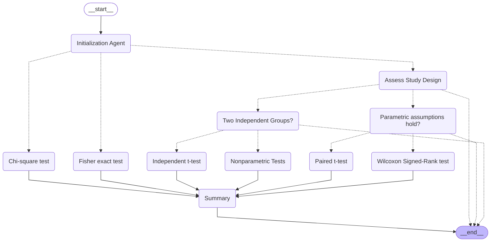

```mermaid
---
config:
  flowchart:
    curve: linear
---
graph TD;
	__start__([<p>__start__</p>]):::first
	Initialization_Agent(Initialization Agent)
	Assess_Study_Design(Assess Study Design)
	Two_Independent_Groups_(Two Independent Groups?)
	Paired_t-test(Paired t-test)
	Wilcoxon_Signed-Rank_test(Wilcoxon Signed-Rank test)
	Independent_t-test(Independent t-test)
	Fisher_exact_test(Fisher exact test)
	Chi-square_test(Chi-square test)
	Parametric_assumptions_hold_(Parametric assumptions hold?)
	Nonparametric_Tests(Nonparametric Tests)
	Summary(Summary)
	__end__([<p>__end__</p>]):::last
	Chi-square_test --> Summary;
	Fisher_exact_test --> Summary;
	Independent_t-test --> Summary;
	Nonparametric_Tests --> Summary;
	Paired_t-test --> Summary;
	Summary --> __end__;
	Wilcoxon_Signed-Rank_test --> Summary;
	__start__ --> Initialization_Agent;
	Initialization_Agent -.-> Assess_Study_Design;
	Initialization_Agent -.-> Chi-square_test;
	Initialization_Agent -.-> Fisher_exact_test;
	Assess_Study_Design -.-> Parametric_assumptions_hold_;
	Assess_Study_Design -.-> Two_Independent_Groups_;
	Assess_Study_Design -.-> __end__;
	Parametric_assumptions_hold_ -.-> Paired_t-test;
	Parametric_assumptions_hold_ -.-> Wilcoxon_Signed-Rank_test;
	Parametric_assumptions_hold_ -.-> __end__;
	Two_Independent_Groups_ -.-> Independent_t-test;
	Two_Independent_Groups_ -.-> Nonparametric_Tests;
	Two_Independent_Groups_ -.-> __end__;
	classDef default fill:#f2f0ff,line-height:1.2
	classDef first fill-opacity:0
	classDef last fill:#bfb6fc

```