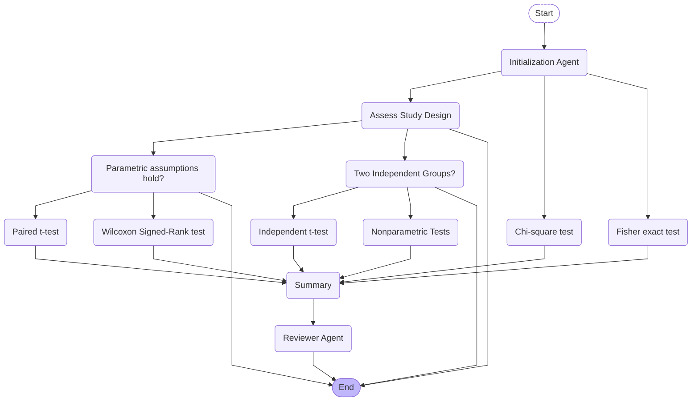

## Canonical metadata (machine-readable)

The API exposes the graph at `GET /analysis/workflow-graph`, and embeds the same payload (with `visited_nodes`, `active_node`, and `selected_path`) in `/analysis/{id}` responses and SSE `step` events. Node IDs are normalized, lowercase identifiers:

- `start` → `initialization_agent` → `assess_study_design`
- Branches: `parametric_assumptions_hold` → `paired_t_test` / `wilcoxon_signed_rank_test`; `two_independent_groups` → `independent_t_test` / `nonparametric_tests`; categorical: `chi_square_test` / `fisher_exact_test`
- Sink: `summary` → `reviewer_agent` → `end` (rendered as `end_node` in the diagram to avoid Mermaid reserved keywords)

Each node includes `id`, `label`, `kind`, and `transitions`; edges are provided as source/target pairs for clients/exports.
